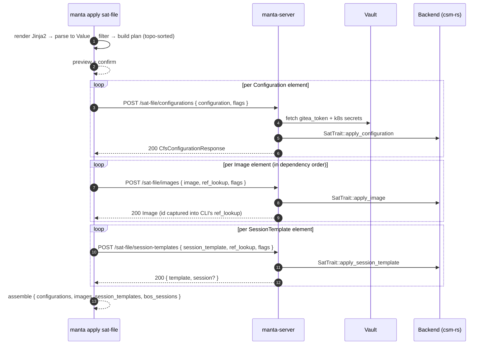

# Manta HTTP API Reference

The manta HTTP server (`manta-server` binary) exposes a REST + WebSocket API. The default port and TLS material come from `~/.config/manta/server.toml` (see [README.md](README.md#configuration-files)); the canonical port in `server.toml.example` is **8443** and TLS is required by default. Omit `cert`/`key` from `[server]` (or pass empty) only for local plain-HTTP testing.

## TL;DR

- **Base URL:** `https://<host>:8443/api/v1`
- **Auth:** every request needs `X-Manta-Site: <site>` + `Authorization: Bearer <token>`, except for `/health`, `/openapi.json`, `/docs`, and `/api/v1/auth/*`.
- **Bootstrap a token:** `POST /api/v1/auth/token` with `{ "username": "...", "password": "..." }` → returns `{ "token": "..." }` from the configured backend.
- **Reads / writes:** standard `GET` / `POST` / `PUT` / `DELETE` per resource (sessions, configurations, nodes, groups, images, templates, boot/kernel parameters, redfish endpoints, hardware, group inventory, migrations, SAT files, power, ephemeral envs).
- **Streaming:** SSE for CFS session logs (`GET /sessions/{name}/logs`); WebSocket upgrades for interactive consoles (`/nodes/{xname}/console`, `/sessions/{name}/console`).
- **Errors:** uniform JSON `{ "error": "..." }` body with conventional HTTP status codes; see the table below.
- **Interactive exploration:** `https://<host>:8443/docs` (Swagger UI loads the spec from `/openapi.json`).

## Starting the server

```
manta-server [--port 8443] [--listen-address 0.0.0.0] [--cert <cert.pem>] [--key <key.pem>]
```

Each flag overrides the corresponding `[server]` field in `server.toml` for that invocation. The CLI does not ship a `serve` subcommand — `manta-server` is its own binary.

## Required headers

Every endpoint requires two headers:

| Header | Description |
|--------|-------------|
| `X-Manta-Site` | Site name as configured in `server.toml` `[sites.X]` (e.g. `cscs_prod`) |
| `Authorization` | `Bearer <shasta-token>` — **not** required for `/health`, `/openapi.json`, `/docs`, or `/api/v1/auth/*` |

```
X-Manta-Site: cscs_prod
Authorization: Bearer <shasta-token>
```

## Base URL

```
https://<host>:8443/api/v1
```

## Error responses

All errors return JSON with an `error` field:

```json
{ "error": "description of what went wrong" }
```

| Status | Meaning |
|--------|---------|
| `400` | Bad request — invalid parameters or body |
| `401` | Missing or malformed `Authorization` header |
| `404` | Resource not found |
| `409` | Conflict — resource already exists |
| `422` | Unprocessable entity — required field missing or wrong type |
| `500` | Backend call failed |
| `501` | Feature requires per-site Vault / Kubernetes config not set (see [Server configuration requirements](#server-configuration-requirements)) |

---

## Sessions

### GET /sessions

List CFS sessions, optionally filtered.

**Query parameters**

| Name | Type | Required | Description |
|------|------|----------|-------------|
| `hsm_group` | string | no | Filter by HSM group name |
| `xnames` | string | no | Comma-separated xnames to filter by |
| `min_age` | string | no | Minimum session age (e.g. `1h`, `2d`) |
| `max_age` | string | no | Maximum session age |
| `session_type` | string | no | `image` or `runtime` |
| `status` | string | no | `pending`, `running`, `complete` |
| `name` | string | no | Exact session name |
| `limit` | u8 | no | Maximum number of results |

**Response `200`** — array of CFS session objects.

---

### POST /sessions

Create a CFS configuration and session from one or more git repositories.

> Requires per-site Vault config (see [Server configuration requirements](#server-configuration-requirements)). Vault is used to fetch the Gitea token.

**Request body**

```json
{
  "repo_names": ["csm-config"],
  "repo_last_commit_ids": ["abc123def456"],
  "cfs_conf_sess_name": "my-session",
  "playbook_yaml_file_name": "site.yaml",
  "hsm_group": "compute",
  "ansible_limit": "x3000c0s1b0n0",
  "ansible_verbosity": "1",
  "ansible_passthrough": ""
}
```

| Field | Type | Required | Description |
|-------|------|----------|-------------|
| `repo_names` | string[] | **yes** | Gitea repository names |
| `repo_last_commit_ids` | string[] | **yes** | Commit SHA for each repo (same order) |
| `cfs_conf_sess_name` | string | no | Name for the config and session (auto-generated if omitted) |
| `playbook_yaml_file_name` | string | no | Ansible playbook file (default: `site.yaml`) |
| `hsm_group` | string | no | Target HSM group |
| `ansible_limit` | string | no | Comma-separated xnames or group names to limit execution |
| `ansible_verbosity` | string | no | Ansible verbosity level (`0`–`4`) |
| `ansible_passthrough` | string | no | Extra arguments passed to `ansible-playbook` |

**Response `201`**

```json
{
  "session_name": "my-session-20240101",
  "configuration_name": "my-session-20240101-config"
}
```

---

### DELETE /sessions/{name}

Delete and cancel a CFS session.

**Path parameters:** `name` — session name.

**Query parameters**

| Name | Type | Required | Description |
|------|------|----------|-------------|
| `dry_run` | bool | no | If `true`, return what would be deleted without deleting (default: `false`) |

**Response `200`** — on dry run: deletion context object. On delete: `{ "deleted": "<name>" }`.

---

### GET /sessions/{name}/logs

Stream CFS session logs as [Server-Sent Events](https://developer.mozilla.org/en-US/docs/Web/API/Server-sent_events).

> Requires per-site Vault + Kubernetes config (see [Server configuration requirements](#server-configuration-requirements)).

**Path parameters:** `name` — CFS session name.

**Query parameters**

| Name | Type | Required | Description |
|------|------|----------|-------------|
| `timestamps` | bool | no | Include timestamps in log lines (default: `false`) |

**Response `200`** — `Content-Type: text/event-stream`. Each log line is delivered as an SSE `data:` event.

```
curl --no-buffer \
  -H "X-Manta-Site: $SITE" \
  -H "Authorization: Bearer $TOKEN" \
  https://host:8443/api/v1/sessions/my-session/logs
```

---

## Configurations

### GET /configurations

List CFS configurations, optionally filtered.

**Query parameters**

| Name | Type | Required | Description |
|------|------|----------|-------------|
| `name` | string | no | Exact configuration name |
| `pattern` | string | no | Name pattern (glob) |
| `hsm_group` | string | no | Filter by associated HSM group |
| `limit` | u8 | no | Maximum number of results |

**Response `200`** — array of CFS configuration objects.

---

### DELETE /configurations

Delete CFS configurations and their dependent images and session templates.

**Query parameters**

| Name | Type | Required | Description |
|------|------|----------|-------------|
| `pattern` | string | no | Name pattern to match configurations |
| `since` | string | no | Delete configurations created after this datetime (`YYYY-MM-DDTHH:MM:SS`) |
| `until` | string | no | Delete configurations created before this datetime |
| `dry_run` | bool | no | Preview without deleting (default: `false`) |

**Response `200`**

```json
{
  "deleted_configurations": ["config-a", "config-b"],
  "deleted_images": ["img-uuid-1"]
}
```

---

## Nodes

### GET /nodes

Get details for one or more nodes.

**Query parameters**

| Name | Type | Required | Description |
|------|------|----------|-------------|
| `xname` | string | **yes** | Node xname (e.g. `x3000c0s1b0n0`) |
| `include_siblings` | bool | no | Include sibling nodes in the same blade (default: `false`) |
| `status` | string | no | Filter by power status |

**Response `200`** — array of node objects.

---

### POST /nodes

Register a new node.

**Request body**

```json
{
  "id": "x3000c0s1b0n0",
  "group": "compute",
  "enabled": true,
  "arch": "X86"
}
```

| Field | Type | Required |
|-------|------|----------|
| `id` | string | **yes** |
| `group` | string | **yes** |
| `enabled` | bool | no (default: `false`) |
| `arch` | string | no |

**Response `201`** — `{ "id": "<xname>" }`.

---

### DELETE /nodes/{id}

Delete a node by xname.

**Path parameters:** `id` — node xname.

**Response `204`** — no content.

---

## Groups (HSM)

### GET /groups

List HSM groups.

**Query parameters**

| Name | Type | Required | Description |
|------|------|----------|-------------|
| `name` | string | no | Exact group name |

**Response `200`** — array of HSM group objects.

---

### GET /groups/available

List the names of HSM groups the authenticated token is allowed to act on. Returns the subset of `GET /groups` that the caller's authorization permits.

**Response `200`** — array of group-name strings:

```json
["compute", "gpu-cluster"]
```

---

### GET /groups/all

List every HSM group on the backend (no authorization filtering). Useful for site operators and read-only dashboards.

**Response `200`** — array of HSM group objects (same shape as `GET /groups`).

---

### POST /groups

Create a new HSM group.

**Request body** — HSM group object:

```json
{
  "label": "my-group",
  "description": "My compute nodes",
  "members": { "ids": ["x3000c0s1b0n0", "x3000c0s3b0n0"] }
}
```

**Response `201`** — `{ "created": true }`.

---

### DELETE /groups/{label}

Delete an HSM group.

**Path parameters:** `label` — group label.

**Query parameters**

| Name | Type | Required | Description |
|------|------|----------|-------------|
| `force` | bool | no | Skip orphan-node check (default: `false`) |

**Response `204`** — no content.

---

### POST /groups/{name}/members

Add nodes to an HSM group.

**Path parameters:** `name` — group name.

**Request body**

```json
{ "hosts_expression": "x3000c0s[1-4]b0n0" }
```

**Response `200`**

```json
{
  "added": ["x3000c0s1b0n0", "x3000c0s2b0n0"],
  "removed": []
}
```

---

### DELETE /groups/{name}/members

Remove nodes from an HSM group.

**Path parameters:** `name` — group name.

**Request body**

```json
{
  "xnames_expression": "x3000c0s1b0n0,x3000c0s2b0n0",
  "dry_run": false
}
```

| Field | Type | Required | Description |
|-------|------|----------|-------------|
| `xnames_expression` | string | **yes** | Hosts expression (xnames, nids, or hostlist notation) |
| `dry_run` | bool | no | Preview without removing (default: `false`) |

**Response `204`** — no content.

---

## Templates (BOS)

### GET /templates

List BOS session templates.

**Query parameters**

| Name | Type | Required | Description |
|------|------|----------|-------------|
| `name` | string | no | Exact template name |
| `hsm_group` | string | no | Filter by associated HSM group |
| `limit` | u8 | no | Maximum number of results |

**Response `200`** — array of BOS session template objects.

---

### POST /templates/{name}/sessions

Create a BOS session from a named template.

**Path parameters:** `name` — BOS session template name.

**Request body**

```json
{
  "operation": "reboot",
  "limit": "compute",
  "session_name": "my-reboot",
  "include_disabled": false,
  "dry_run": false
}
```

| Field | Type | Required | Description |
|-------|------|----------|-------------|
| `operation` | string | **yes** | `boot`, `reboot`, or `shutdown` |
| `limit` | string | **yes** | Comma-separated xnames or HSM group names |
| `session_name` | string | no | Name for the BOS session (auto-generated if omitted) |
| `include_disabled` | bool | no | Include disabled nodes (default: `false`) |
| `dry_run` | bool | no | Return the session object without creating it (default: `false`) |

**Response `201`** (or `200` on dry run) — BOS session object.

---

## Images

### GET /images

List IMS images.

**Query parameters**

| Name | Type | Required | Description |
|------|------|----------|-------------|
| `id` | string | no | Exact image ID |
| `hsm_group` | string | no | Filter by associated HSM group |
| `limit` | u8 | no | Maximum number of results |

**Response `200`** — array of objects:

```json
[
  {
    "image": { ... },
    "configuration_name": "csm-config-1.0",
    "image_id": "uuid-here",
    "is_linked": true
  }
]
```

---

### DELETE /images

Delete one or more IMS images.

**Query parameters**

| Name | Type | Required | Description |
|------|------|----------|-------------|
| `ids` | string | **yes** | Comma-separated image IDs |
| `dry_run` | bool | no | Preview without deleting (default: `false`) |

**Response `200`**

```json
{ "deleted": ["uuid-1", "uuid-2"] }
```

---

## Boot parameters

### GET /boot-parameters

Get BSS boot parameters.

**Query parameters**

| Name | Type | Required | Description |
|------|------|----------|-------------|
| `hsm_group` | string | no | Filter by HSM group |
| `nodes` | string | no | Comma-separated xnames |

**Response `200`** — boot parameters object.

---

### POST /boot-parameters

Add boot parameters.

**Request body** — BSS BootParameters object.

**Response `201`** — `{ "created": true }`.

---

### PUT /boot-parameters

Update boot parameters for specified nodes.

**Request body**

```json
{
  "hosts": ["x3000c0s1b0n0"],
  "params": "console=ttyS0,115200n8 quiet",
  "kernel": "s3://boot-images/kernel",
  "initrd": "s3://boot-images/initrd"
}
```

| Field | Type | Required | Description |
|-------|------|----------|-------------|
| `hosts` | string[] | **yes** | Target node xnames |
| `params` | string | **yes** | Kernel command-line parameters string |
| `kernel` | string | **yes** | S3 path to the kernel image |
| `initrd` | string | **yes** | S3 path to the initrd image |
| `nids` | u32[] | no | Node IDs (alternative identifier) |
| `macs` | string[] | no | MAC addresses (alternative identifier) |

**Response `204`** — no content.

---

### DELETE /boot-parameters

Delete boot parameters for a set of nodes.

**Request body**

```json
{ "hosts": ["x3000c0s1b0n0"] }
```

**Response `204`** — no content.

---

## Kernel parameters

### GET /kernel-parameters

Get kernel parameters for nodes.

**Query parameters**

| Name | Type | Required | Description |
|------|------|----------|-------------|
| `hsm_group` | string | no | Filter by HSM group |
| `nodes` | string | no | Comma-separated xnames |

**Response `200`** — kernel parameters object.

---

### POST /kernel-parameters/add

Append kernel parameters to a set of nodes without replacing existing ones.

**Request body**

```json
{
  "params": "console=ttyS0,115200n8",
  "xnames_expression": "x3000c0s[1-4]b0n0",
  "hsm_group": null,
  "overwrite": false,
  "project_sbps": true,
  "dry_run": false
}
```

| Field | Type | Required | Description |
|-------|------|----------|-------------|
| `params` | string | **yes** | Space-separated kernel parameters to add |
| `xnames_expression` | string | no | Hosts expression (xnames, nids, or hostlist notation); mutually exclusive with `hsm_group` |
| `hsm_group` | string | no | Target HSM group; mutually exclusive with `xnames_expression` |
| `overwrite` | bool | no | Overwrite a parameter if it already exists (default: `false`) |
| `project_sbps` | bool | no | Project SBPS images (default: `true`) |
| `dry_run` | bool | no | Preview without persisting (default: `false`) |

**Response `200`**

```json
{
  "applied": true,
  "has_changes": true,
  "xnames_to_reboot": ["x3000c0s1b0n0"]
}
```

---

### POST /kernel-parameters/apply

Add, replace, or delete kernel parameters for a set of nodes.

**Request body**

```json
{
  "xnames_expression": "x3000c0s[1-4]b0n0",
  "hsm_group": null,
  "operation": "add",
  "params": "console=ttyS0,115200n8",
  "overwrite": false,
  "project_sbps": true,
  "dry_run": false
}
```

| Field | Type | Required | Description |
|-------|------|----------|-------------|
| `operation` | string | **yes** | `add`, `apply` (replace all), or `delete` |
| `params` | string | **yes** | Space-separated kernel parameters |
| `xnames_expression` | string | no | Hosts expression; mutually exclusive with `hsm_group` |
| `hsm_group` | string | no | Target HSM group; mutually exclusive with `xnames_expression` |
| `overwrite` | bool | no | For `add`: overwrite existing params (default: `false`) |
| `project_sbps` | bool | no | Project SBPS images (default: `true`) |
| `dry_run` | bool | no | Preview without persisting (default: `false`) |

**Response `200`**

```json
{
  "applied": true,
  "has_changes": true,
  "xnames_to_reboot": ["x3000c0s1b0n0"]
}
```

---

### DELETE /kernel-parameters

Remove specific kernel parameters from a set of nodes.

**Request body**

```json
{
  "params": "console=ttyS0,115200n8",
  "xnames_expression": "x3000c0s[1-4]b0n0",
  "hsm_group": null,
  "dry_run": false
}
```

| Field | Type | Required | Description |
|-------|------|----------|-------------|
| `params` | string | **yes** | Space-separated kernel parameters to remove |
| `xnames_expression` | string | no | Hosts expression; mutually exclusive with `hsm_group` |
| `hsm_group` | string | no | Target HSM group; mutually exclusive with `xnames_expression` |
| `dry_run` | bool | no | Preview without persisting (default: `false`) |

**Response `200`**

```json
{
  "applied": true,
  "has_changes": true,
  "xnames_to_reboot": ["x3000c0s1b0n0"]
}
```

---

## Boot configuration

### POST /boot-config

Apply a combined boot configuration (image + runtime config + kernel params) to a set of nodes.

**Request body**

```json
{
  "hosts_expression": "compute",
  "boot_image_id": "ims-image-uuid",
  "boot_image_configuration": "csm-config-1.0",
  "kernel_parameters": "console=ttyS0",
  "runtime_configuration": "csm-config-1.0",
  "dry_run": false
}
```

| Field | Type | Required | Description |
|-------|------|----------|-------------|
| `hosts_expression` | string | **yes** | Xnames, nodeset expression, or HSM group name |
| `boot_image_id` | string | no | IMS image ID to set as boot image |
| `boot_image_configuration` | string | no | CFS configuration to link to the boot image |
| `kernel_parameters` | string | no | Kernel parameters to set |
| `runtime_configuration` | string | no | CFS configuration for runtime |
| `dry_run` | bool | no | Preview without persisting (default: `false`) |

**Response `200`**

```json
{
  "applied": true,
  "nodes": ["x3000c0s1b0n0"],
  "need_restart": false
}
```

---

## Power management

### POST /power

Power on, off, or reset nodes or an entire cluster.

**Request body**

```json
{
  "action": "reset",
  "targets_expression": "x3000c0s[1-4]b0n0",
  "target_type": "nodes",
  "force": false
}
```

| Field | Type | Required | Description |
|-------|------|----------|-------------|
| `action` | string | **yes** | `on`, `off`, or `reset` (lowercase; serde rejects anything else with 422) |
| `targets_expression` | string | **yes** | Hosts expression (for `target_type: nodes`) or HSM group name (for `target_type: cluster`) |
| `target_type` | string | **yes** | `nodes` or `cluster` |
| `force` | bool | no | Hard power off/reset without graceful shutdown (default: `false`) |

**Response `200`** — PCS `TransitionResponse` object.

---

## Redfish endpoints

### GET /redfish-endpoints

List Redfish endpoints.

**Query parameters**

| Name | Type | Required | Description |
|------|------|----------|-------------|
| `id` | string | no | Filter by ID |
| `fqdn` | string | no | Filter by FQDN |
| `uuid` | string | no | Filter by UUID |
| `macaddr` | string | no | Filter by MAC address |
| `ipaddress` | string | no | Filter by IP address |

**Response `200`** — array of Redfish endpoint objects.

---

### POST /redfish-endpoints

Add a Redfish endpoint.

**Request body** — Redfish endpoint parameters object.

**Response `201`** — `{ "created": true }`.

---

### PUT /redfish-endpoints

Update a Redfish endpoint.

**Request body** — Redfish endpoint parameters object.

**Response `204`** — no content.

---

### DELETE /redfish-endpoints/{id}

Delete a Redfish endpoint.

**Path parameters:** `id` — endpoint ID.

**Response `204`** — no content.

---

## Group inventory

### GET /groups/nodes

Get node details for an HSM group with optional power-status filtering.

**Query parameters**

| Name | Type | Required | Description |
|------|------|----------|-------------|
| `hsm_group` | string | no | HSM group name. When omitted the response covers every group the bearer token can access. |
| `status` | string | no | Filter by node power status (`ON`, `OFF`, `READY`, …) |

**Response `200`** — array of node-detail objects.

---

### GET /groups/hardware

Get a hardware component summary per node for an HSM group.

**Query parameters**

| Name | Type | Required | Description |
|------|------|----------|-------------|
| `hsm_group` | string | no | HSM group name. When omitted the response covers every group the bearer token can access. |

**Response `200`** — object with `hsm_group_name` and `node_summaries`.

---

### GET /clusters *(deprecated)*

Old alias for `GET /groups/nodes`. Same query parameters, same response. Continues to work for one release; the server logs a warning on every request. Drop in the next major release.

---

### GET /hardware-clusters *(deprecated)*

Old alias for `GET /groups/hardware`. Same query parameters, same response. Continues to work for one release; the server logs a warning on every request. Drop in the next major release.

---

### GET /hardware-nodes-list

Get hardware component details for specific nodes.

**Query parameters**

| Name | Type | Required | Description |
|------|------|----------|-------------|
| `xnames` | string | **yes** | Comma-separated xnames |

**Response `200`** — object with a `node_summaries` array.

---

## Hardware-component group management

> The write endpoints in this section still use `/hardware-clusters/{target}/...`
> in the URL and `parent_cluster` / `target_cluster` as JSON field names. A
> parallel rename to `/groups/{target}/hardware/...` + `parent_group` /
> `target_group` is planned for a future release and will mirror the
> deprecation pattern used by `GET /clusters` / `GET /hardware-clusters`
> above. Existing client code keeps working in the meantime.

### POST /hardware-clusters/{target}/members

Add hardware components (nodes) to a target cluster, sourcing them from a parent cluster.

**Path parameters:** `target` — destination HSM group name.

**Request body**

```json
{
  "parent_cluster": "nodes_free",
  "pattern": "Memory=512:Processors=2",
  "create_hsm_group": false,
  "dry_run": false
}
```

| Field | Type | Required | Description |
|-------|------|----------|-------------|
| `parent_cluster` | string | **yes** | Source HSM group to draw nodes from |
| `pattern` | string | **yes** | Hardware component pattern to match (e.g. `Memory=512:Processors=2`) |
| `create_hsm_group` | bool | no | Create the target group if it doesn't exist (default: `false`) |
| `dry_run` | bool | no | Preview without moving nodes (default: `false`) |

**Response `200`**

```json
{
  "dry_run": false,
  "nodes_moved": ["x3000c0s1b0n0"],
  "target_cluster": "my-cluster",
  "target_nodes": ["x3000c0s1b0n0"],
  "parent_cluster": "nodes_free",
  "parent_nodes": ["x3000c0s2b0n0"]
}
```

---

### DELETE /hardware-clusters/{target}/members

Remove hardware components from a target cluster and return them to a parent cluster.

**Path parameters:** `target` — source HSM group name.

**Request body**

```json
{
  "parent_cluster": "nodes_free",
  "pattern": "Memory=512:Processors=2",
  "delete_hsm_group": false,
  "dry_run": false
}
```

| Field | Type | Required | Description |
|-------|------|----------|-------------|
| `parent_cluster` | string | **yes** | Destination HSM group for returned nodes |
| `pattern` | string | **yes** | Hardware component pattern to match |
| `delete_hsm_group` | bool | no | Delete the target group if it becomes empty (default: `false`) |
| `dry_run` | bool | no | Preview without moving nodes (default: `false`) |

**Response `200`** — same shape as `POST /hardware-clusters/{target}/members`.

---

### POST /hardware-clusters/{target}/configuration

Pin or unpin a hardware cluster configuration by moving nodes between the target and parent cluster according to a hardware component pattern.

**Path parameters:** `target` — target HSM group name.

**Request body**

```json
{
  "parent_cluster": "nodes_free",
  "pattern": "Memory=512:Processors=2",
  "mode": "pin",
  "create_target_hsm_group": true,
  "delete_empty_parent_hsm_group": true,
  "dry_run": false
}
```

| Field | Type | Required | Description |
|-------|------|----------|-------------|
| `parent_cluster` | string | **yes** | Source/destination HSM group |
| `pattern` | string | **yes** | Hardware component pattern to match |
| `mode` | string | no | `"pin"` (move nodes into target) or `"unpin"` (move nodes back to parent) — default: `"pin"` |
| `create_target_hsm_group` | bool | no | Create the target group if it doesn't exist (default: `true`) |
| `delete_empty_parent_hsm_group` | bool | no | Delete the parent group if it becomes empty (default: `true`) |
| `dry_run` | bool | no | Preview without moving nodes (default: `false`) |

**Response `200`**

```json
{
  "dry_run": false,
  "target_cluster": "my-cluster",
  "target_nodes": ["x3000c0s1b0n0"],
  "parent_cluster": "nodes_free",
  "parent_nodes": []
}
```

---

## Migration

### POST /migrate/nodes

Move nodes between HSM groups (vClusters).

**Request body**

```json
{
  "target_hsm_names": ["target-cluster"],
  "parent_hsm_names": ["parent-cluster"],
  "hosts_expression": "x3000c0s[1-4]b0n0",
  "dry_run": false,
  "create_hsm_group": false
}
```

| Field | Type | Required | Description |
|-------|------|----------|-------------|
| `target_hsm_names` | string[] | **yes** | Destination HSM group(s) |
| `parent_hsm_names` | string[] | **yes** | Source HSM group(s) |
| `hosts_expression` | string | **yes** | Nodes to migrate |
| `dry_run` | bool | no | Preview without migrating (default: `false`) |
| `create_hsm_group` | bool | no | Create the target group if it doesn't exist (default: `false`) |

**Response `200`** — migration results object.

---

### POST /migrate/backup

Back up vCluster configuration to files.

**Request body**

```json
{
  "bos": "my-cluster",
  "destination": "/backups/cluster"
}
```

**Response `200`** — `{ "completed": true }`.

---

### POST /migrate/restore

Restore a vCluster from backup files.

**Request body**

```json
{
  "bos_file": "/backups/bos.yaml",
  "cfs_file": "/backups/cfs.yaml",
  "hsm_file": "/backups/hsm.yaml",
  "ims_file": "/backups/ims.yaml",
  "image_dir": "/backups/images",
  "overwrite": false
}
```

All fields optional. `overwrite` defaults to `false`.

**Response `200`** — `{ "completed": true }`.

---

## Ephemeral environments

### POST /ephemeral-env

Create an ephemeral CFS environment from an existing image.

**Request body**

```json
{ "image_id": "ims-image-uuid" }
```

**Response `201`** — `{ "hostname": "<allocated-hostname>" }`.

---

## SAT files

The SAT (Shasta Artifact Template) workflow is split across four endpoints. `manta apply sat-file` walks the parsed SAT file into an ordered execution plan on the **client** side and dispatches one element per HTTP call — `POST /sat-file/configurations`, `POST /sat-file/images`, `POST /sat-file/session-templates`. The legacy `POST /sat-file` whole-file endpoint is retained for SAT files with a `hardware:` section until the hardware path is moved to its own per-element endpoint.

> All SAT endpoints require per-site Vault + Kubernetes config (see [Server configuration requirements](#server-configuration-requirements)).

**Client responsibility.** Jinja2 rendering, parsing the rendered YAML into a structured value, the `image_only` / `session_template_only` filters (drop top-level sections + prune unreferenced configurations/images), the topological sort of images by `base.image_ref`, and validation of in-file cross-references (no dangling `image_ref`, no cycles) all run client-side. The server accepts each SAT entry as a `serde_json::Value`, threads it through the backend's per-element `SatTrait` method, and returns the created wire artifact. The canonical SAT schema lives in csm-rs — neither the CLI nor the server embed it.



### POST /sat-file/configurations

Apply one entry from the SAT file's `configurations` section. csm-rs validates the entry against live CSM state, resolves any `product:` layer via the `cray-product-catalog` ConfigMap and any `branch:` via Gitea, posts the resulting `CfsConfigurationRequest`, and returns the created CFS configuration.

**Request body**

```json
{
  "configuration": { "name": "cfg-v1", "layers": [/* ... */] },
  "overwrite": false,
  "dry_run": false
}
```

| Field | Type | Required | Description |
|-------|------|----------|-------------|
| `configuration` | object | **yes** | One SAT `configurations[]` entry. |
| `overwrite` | bool | no | Replace an existing CFS configuration of the same name (default: `false`). |
| `dry_run` | bool | no | Validate without creating; response carries a mock `CfsConfigurationResponse` with the name set (default: `false`). |

**Response `200`** — the created `CfsConfigurationResponse`.

### POST /sat-file/images

Apply one entry from the SAT file's `images` section. The body includes the CLI's accumulated `ref_lookup` so the backend can resolve `base.image_ref` chains; the CLI inserts `image.ref_name.or(image.name) → image.id` into the map after each successful image POST.

**Request body**

```json
{
  "image": { "name": "img-v1", "ref_name": "base", "base": {/* ... */}, "configuration": "cfg-v1" },
  "ref_lookup": { "earlier-ref": "<image-id>" },
  "ansible_verbosity": 0,
  "ansible_passthrough": null,
  "watch_logs": false,
  "timestamps": false,
  "dry_run": false
}
```

| Field | Type | Required | Description |
|-------|------|----------|-------------|
| `image` | object | **yes** | One SAT `images[]` entry. |
| `ref_lookup` | object | no | `ref_name → image_id` for images created earlier in the apply (default: empty). |
| `ansible_verbosity` | u8 | no | Ansible verbosity level 0–4 for the CFS session that builds the image. |
| `ansible_passthrough` | string | no | Extra arguments passed to `ansible-playbook`. |
| `watch_logs` | bool | no | Stream CFS session logs while the image builds (default: `false`). |
| `timestamps` | bool | no | Prefix streamed log lines with timestamps (default: `false`). |
| `dry_run` | bool | no | Validate without building; response carries a mock `Image` with a `DRYRUN_<uuid>` id (default: `false`). |

**Response `200`** — the created IMS `Image` (with `id`, `name`, `link.path`/`link.etag`/`link.type` for the S3 manifest).

### POST /sat-file/session-templates

Apply one entry from the SAT file's `session_templates` section. The CLI's `ref_lookup` is used to resolve `image.image_ref`. If `reboot=true` (and not `dry_run`), a BOS session is also created to reboot the targeted nodes through the template.

**Request body**

```json
{
  "session_template": { "name": "st-1", "image": { "image_ref": "base" }, "configuration": "cfg-v1", "bos_parameters": {/* ... */} },
  "ref_lookup": { "base": "<image-id>" },
  "reboot": false,
  "dry_run": false
}
```

| Field | Type | Required | Description |
|-------|------|----------|-------------|
| `session_template` | object | **yes** | One SAT `session_templates[]` entry. |
| `ref_lookup` | object | no | `ref_name → image_id` for images created earlier in the apply (default: empty). |
| `reboot` | bool | no | After the template is created, trigger a BOS session to reboot the targeted nodes (default: `false`). |
| `dry_run` | bool | no | Validate without creating; the response carries a mock template and `session: null` (default: `false`). |

**Response `200`**

```json
{
  "template": { /* BosSessionTemplate, ... */ },
  "session":  { /* BosSession, ... */ } /* or null when reboot=false or dry_run=true */
}
```

### POST /sat-file (legacy)

Apply a whole pre-rendered SAT file in one call. Retained for SAT files with a `hardware:` section while the per-element flow only covers configurations, images, and session_templates. The CLI no longer invokes this endpoint; a follow-up will either move hardware to its own per-element endpoint and remove this one, or drop hardware support from `manta apply sat-file`.

**Request body**

```json
{
  "sat_file": {
    "configurations": [{ "name": "cfg-v1", "layers": [/* ... */] }],
    "images":         [{ "name": "img-v1", "configuration": "cfg-v1", "ims": {/* ... */} }],
    "session_templates": [/* ... */],
    "hardware": [/* ... */]
  },
  "ansible_verbosity": 0,
  "ansible_passthrough": "",
  "reboot": false,
  "watch_logs": false,
  "timestamps": false,
  "overwrite": false,
  "dry_run": false
}
```

| Field | Type | Required | Description |
|-------|------|----------|-------------|
| `sat_file` | object | **yes** | Whole SAT file as a structured value — Jinja2 already evaluated client-side. The schema mirrors the SAT YAML spec (top-level keys `configurations`, `images`, `session_templates`, optionally `hardware`); the server forwards the value verbatim to the backend, which knows the schema. |
| `ansible_verbosity` | u8 | no | Ansible verbosity level 0–4 |
| `ansible_passthrough` | string | no | Extra arguments passed to `ansible-playbook` |
| `reboot` | bool | no | Reboot nodes after applying session templates (default: `false`) |
| `watch_logs` | bool | no | Stream CFS session logs during apply (default: `false`) |
| `timestamps` | bool | no | Include timestamps in streamed logs (default: `false`) |
| `overwrite` | bool | no | Overwrite existing configurations and images (default: `false`) |
| `dry_run` | bool | no | Validate without creating anything (default: `false`) |

**Response `200`** — the same four-list summary the per-element flow produces:

```json
{
  "configurations":    [ /* CfsConfigurationResponse, ... */ ],
  "images":            [ /* IMS Image, ... */ ],
  "session_templates": [ /* BosSessionTemplate, ... */ ],
  "bos_sessions":      [ /* BosSession, ... */ ]
}
```

---

## Authentication

The CLI obtains a bearer token by exchanging Keycloak credentials through the server. These endpoints **do not** themselves require an `Authorization` header (they're the bootstrap), but they do require `X-Manta-Site` so the server can pick the right backend. They sit under `/api/v1/auth/*` behind a per-source-IP rate limiter (`[server].auth_rate_limit_per_minute`, default 60) and a body-redaction logging layer.

### POST /auth/token

Exchange username + password for a backend bearer token.

**Request body**

```json
{ "username": "alice", "password": "..." }
```

**Response `200`**

```json
{ "token": "<backend-bearer-token>" }
```

**Response `401`** — `{ "error": "invalid credentials" }`. The body is intentionally generic regardless of whether the user was unknown or the password was wrong; detail is kept in server-side logs only.

---

### POST /auth/validate

Check whether a bearer token is still accepted by the backend.

**Request body**

```json
{ "token": "<backend-bearer-token>" }
```

**Response `200`** — no body. The token is currently valid.

**Response `401`** — `{ "error": "invalid credentials" }`. The token is missing, malformed, or rejected by the backend.

---

## Interactive consoles (WebSocket)

Both console endpoints use the standard WebSocket upgrade handshake. Authentication is checked during the HTTP upgrade — a missing or invalid `Authorization` header returns `401` before the WebSocket connection is established. The server closes the connection after **30 minutes of inactivity** (configurable via `[server].console_inactivity_timeout_secs`; inactivity tracks the client side only — server-side log scroll does not reset the timer).

Once connected, the WebSocket carries raw terminal I/O:
- **Text or binary frames sent by the client** are forwarded as stdin to the console.
- **Binary frames sent by the server** are stdout from the console.
- **Text frames matching `{"type":"resize","cols":N,"rows":N}`** are consumed silently (dynamic resize is not yet supported by the backend trait).

```
wscat -H "Authorization: Bearer $TOKEN" \
  -H "X-Manta-Site: $SITE" \
  --connect wss://host:8443/api/v1/nodes/x3000c0s1b0n0/console
```

---

### WS /nodes/{xname}/console

Open an interactive console to a node.

> Requires per-site Vault + Kubernetes config (see [Server configuration requirements](#server-configuration-requirements)).

**Path parameters:** `xname` — node xname (e.g. `x3000c0s1b0n0`).

**Query parameters**

| Name | Type | Required | Description |
|------|------|----------|-------------|
| `cols` | u16 | no | Terminal width in columns (default: `80`) |
| `rows` | u16 | no | Terminal height in rows (default: `24`) |

**Upgrade response `101`** — WebSocket connection established.

---

### WS /sessions/{name}/console

Open an interactive console to the Ansible container of a running image-type CFS session.

> Requires per-site Vault + Kubernetes config (see [Server configuration requirements](#server-configuration-requirements)). The session must exist, be of type `image`, and have status `running`. Returns `409` if those conditions are not met.

**Path parameters:** `name` — CFS session name.

**Query parameters**

| Name | Type | Required | Description |
|------|------|----------|-------------|
| `cols` | u16 | no | Terminal width in columns (default: `80`) |
| `rows` | u16 | no | Terminal height in rows (default: `24`) |

**Upgrade response `101`** — WebSocket connection established.

---

## Health check

### GET /health

Returns server health. Does not require authentication.

**Response `200`** — `{ "status": "ok" }`.

---

## API documentation

### GET /openapi.json

Returns the OpenAPI 3.0 specification for the manta API as JSON. Does not require authentication.

**Response `200`** — OpenAPI 3.0 document.

---

### GET /docs

Serves the Swagger UI, pre-configured to load the spec from `/openapi.json`. Does not require authentication. Open in a browser to browse and try out all endpoints interactively.

---

## Server configuration requirements

Some endpoints require per-site Vault and Kubernetes settings in `~/.config/manta/server.toml`. The relevant keys are nested under the selected `[sites.X]`:

```toml
[sites.alps.k8s]
api_url = "https://10.0.0.10:6443"

[sites.alps.k8s.authentication.vault]
base_url = "https://vault.example.com:8200"
```

When either is missing for the active site, the affected endpoints return `501 Not Implemented` with an explanatory `error` body.

| Required site config | Used by |
|---|---|
| `[sites.X.k8s.authentication.vault].base_url` | `POST /sessions`, `GET /sessions/{name}/logs`, `POST /sat-file`, `WS /nodes/{xname}/console`, `WS /sessions/{name}/console` |
| `[sites.X.k8s].api_url` | `GET /sessions/{name}/logs`, `POST /sat-file`, `WS /nodes/{xname}/console`, `WS /sessions/{name}/console` |

## Troubleshooting

If a request fails before reaching the service layer, you'll get one of the codes below. Match the response code against the table, then re-issue with a corrected `curl`. Bumping the server's `log` filter to `debug` (`log = "debug"` in `server.toml`, then restart) makes it obvious which extractor rejected.

| Status | Most common cause |
|---|---|
| **400 Bad Request** | Missing/malformed `X-Manta-Site` header, missing JSON body, or body not parseable as the declared `request_body` type. |
| **401 Unauthorized** | No `Authorization: Bearer …` (on a protected endpoint), token expired, or `/auth/token` credentials rejected by the backend. |
| **404 Not Found** | Wrong URL path or the resource ID does not exist for the active site. |
| **405 Method Not Allowed** | Sent `GET` to a `POST`-only endpoint (or vice versa) — `curl` defaults to `GET` when `-X` is omitted. |
| **408 Request Timeout** | The handler took longer than the server's per-route timeout. `POST /power` has its own ceiling (`[server].power_timeout_secs`, default 600); every other route falls back to `[server].request_timeout_secs` (default 60). Bump the relevant knob in `server.toml` for sites where legitimate operations exceed the default. |
| **429 Too Many Requests** | Per-source-IP rate limit on `/api/v1/auth/*`. Tune `[server].auth_rate_limit_per_minute` or wait one minute. |
| **500 Internal Server Error** | Server-side failure (backend unreachable, bad config). Check `journalctl -u manta-server` (or wherever the server's stderr is logged) for the actual cause. |
| **501 Not Implemented** | The endpoint needs Vault or Kubernetes settings that the active site does not provide — see [Server configuration requirements](#server-configuration-requirements). |

If `curl` can't connect at all (`Connection refused`, TLS handshake failure), the issue is below the HTTP layer: check the server is running on the port you're hitting, that `https://` matches your `cert`/`key` configuration, and that any reverse proxy in front is healthy.

### Reusable shell vars

The recipes below assume:

```bash
export MANTA_HOST=https://localhost:8443
export MANTA_SITE=alps
export MANTA_TOKEN=...   # see "Bootstrap a token" below
```

For a local server running plain HTTP (no `cert`/`key` configured), use `MANTA_HOST=http://localhost:8443` and drop the `-k` flag.

### Health & docs (no auth)

```bash
curl -k "$MANTA_HOST/health"
curl -k "$MANTA_HOST/openapi.json" | jq .info
# Open in browser: $MANTA_HOST/docs
```

### Bootstrap a token

```bash
curl -k -X POST "$MANTA_HOST/api/v1/auth/token" \
  -H "X-Manta-Site: $MANTA_SITE" \
  -H 'Content-Type: application/json' \
  -d '{"username":"<user>","password":"<pass>"}'
# → { "token": "..." }
```

Then export it for the recipes below:

```bash
export MANTA_TOKEN=$(curl -ks -X POST "$MANTA_HOST/api/v1/auth/token" \
  -H "X-Manta-Site: $MANTA_SITE" -H 'Content-Type: application/json' \
  -d '{"username":"<user>","password":"<pass>"}' | jq -r .token)
```

### Validate a token

```bash
curl -k -X POST "$MANTA_HOST/api/v1/auth/validate" \
  -H "X-Manta-Site: $MANTA_SITE" \
  -H 'Content-Type: application/json' \
  -d "{\"token\":\"$MANTA_TOKEN\"}"
# 200 OK = valid, 401 = rejected
```

### GET a resource

```bash
curl -k "$MANTA_HOST/api/v1/sessions" \
  -H "X-Manta-Site: $MANTA_SITE" \
  -H "Authorization: Bearer $MANTA_TOKEN"
```

### POST a resource

```bash
curl -k -X POST "$MANTA_HOST/api/v1/groups" \
  -H "X-Manta-Site: $MANTA_SITE" \
  -H "Authorization: Bearer $MANTA_TOKEN" \
  -H 'Content-Type: application/json' \
  -d '{"label":"test-group","description":"smoke test"}'
```

### DELETE a resource

```bash
curl -k -X DELETE "$MANTA_HOST/api/v1/groups/test-group" \
  -H "X-Manta-Site: $MANTA_SITE" \
  -H "Authorization: Bearer $MANTA_TOKEN"
```

### Stream CFS session logs (SSE)

```bash
curl -kN "$MANTA_HOST/api/v1/sessions/<session-name>/logs?timestamps=true" \
  -H "X-Manta-Site: $MANTA_SITE" \
  -H "Authorization: Bearer $MANTA_TOKEN"
```

`-N` disables curl's output buffering so SSE events appear as they arrive.

### Attach to an interactive console (WebSocket)

`curl` cannot upgrade to a WebSocket; use [`websocat`](https://github.com/vi/websocat) or `wscat`:

```bash
websocat -k --header "X-Manta-Site: $MANTA_SITE" \
  --header "Authorization: Bearer $MANTA_TOKEN" \
  "wss://localhost:8443/api/v1/nodes/<xname>/console"
```

### When `-vvv` still doesn't explain it

1. Bump the server log: `log = "debug"` in `server.toml`, restart.
2. Re-issue the request; the server now logs which extractor rejected (site lookup vs. JSON parse vs. backend call) and the round-trip into csm-rs/ochami-rs.
3. For auth failures, the server logs the user/site/source-IP and the backend error message — the client only sees a generic `invalid credentials` 401 on purpose.
