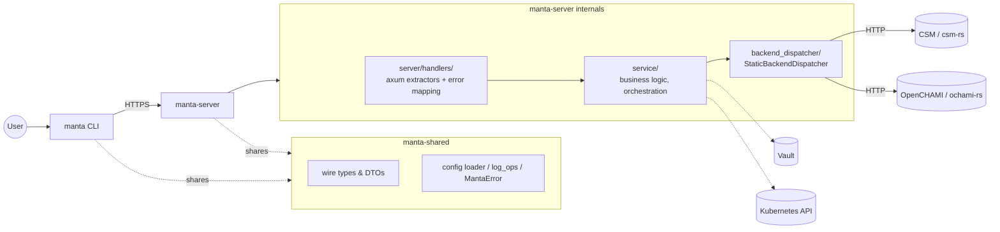

# Manta Architecture

This document describes the internal structure of the manta codebase for contributors.

---

## Workspace layout

manta is a Cargo workspace with three member crates:

```
manta/
├── Cargo.toml                       (workspace manifest)
└── crates/
    ├── manta-shared/   (lib)        — wire types, common helpers, backend dispatcher
    ├── manta-cli/      (bin)        — terminal client, depends on manta-shared
    └── manta-server/   (bin)        — Axum HTTPS server + service layer, depends on manta-shared
```

Dep graph: `manta-cli → manta-shared ← manta-server`. Neither binary depends on the other, so each can be built and shipped on its own (`cargo build -p manta-cli` / `cargo build -p manta-server`).

`manta-shared` exposes two top-level modules:

| Module | Used by | Contents |
|--------|---------|----------|
| `shared` | both bins | Wire types (`params/`, `dto`) and `cluster_status` helpers |
| `common` | both bins | Config loader (untyped `Config`), `MantaError`, logging |

The backend bridge (`StaticBackendDispatcher` enum and the trait-impl blocks routing to `csm-rs`/`ochami-rs`, plus the `authorization` helpers that take a `&StaticBackendDispatcher`) lives in **`manta-server` only** (`crates/manta-server/src/backend_dispatcher/mod.rs`, `dispatcher.rs`, `service/authorization.rs`). The CLI never reaches them.

`manta-cli` keeps its CLI-only modules under `crates/manta-cli/src/cli/common/` (e.g. `app_context::AppContext`, `config::CliConfiguration`, `authentication`, `hooks`, `sat_file` Jinja renderer); `manta-server` keeps cross-tier helpers under `crates/manta-server/src/server/common/` (`app_context::InfraContext`, `audit`, `jwt_ops`, `kafka`, `vault`) and its typed server config schema at `crates/manta-server/src/config.rs`. The bulk of service-tier orchestration (`node_ops`, `authorization`, `ims_ops`, `boot_parameters`, plus the `hw_cluster` family) lives under `crates/manta-server/src/service/`.

---

## Layer overview



Both binaries share `manta-shared`. The CLI does not link the service layer, axum, csm-rs, or ochami-rs; the server owns the entire backend bridge. Pure helpers in `manta-shared` (e.g. SAT-file Jinja2 rendering) are used by the CLI; SAT-file processing (the `serde_json::Value`-walking `image_only`/`session_template_only` filter, the topological sort by `base.image_ref`, and the dispatch loop that POSTs one element at a time to per-section endpoints) lives in `manta-cli`'s `apply_sat_file::plan` / `apply_sat_file::dispatch` modules. The server is a pass-through for each SAT entry. The canonical SAT-file schema lives in csm-rs — the CLI carries each SAT element as a `serde_json::Value` end-to-end and never embeds the typed struct shape.

---

## Entry points

Each binary has its own `main.rs`:

### `crates/manta-cli/src/main.rs`

Startup runs in two phases:

1. **Single-threaded phase** — parse CLI args, load `cli.toml` from the platform config directory (Linux: `~/.config/manta/cli.toml` or `$XDG_CONFIG_HOME/manta/cli.toml`; macOS: `~/Library/Application Support/local.cscs.manta/cli.toml`) into a `CliConfiguration`. If the optional top-level `socks5_proxy` is set, export `SOCKS5` so `reqwest` picks it up for connections to manta-server.
2. **Multi-threaded phase** — start the tokio runtime, build an `AppContext` (site name, manta-server URL, settings, HSM filter, Kafka audit), and dispatch the requested CLI command. The CLI never instantiates `StaticBackendDispatcher` — every backend operation goes through `MantaClient` HTTPS calls to manta-server.

### `crates/manta-server/src/main.rs`

Mirrors the CLI bootstrap, then starts the HTTPS server. Minimal Clap surface: `--port`, `--cert`, `--key`, `--listen-address`. The `manta serve` subcommand has been removed from the CLI; users invoke `manta-server` directly.

---

## Layer responsibilities

### `crates/manta-cli/src/cli/`

Presentation layer. Responsibilities:

- **`build/`** — Clap command and subcommand definitions.
- **`process/`** — Argument extraction and dispatch to the service layer (via `manta-shared` helpers or HTTP calls through `MantaClient`).
- **`http_client/`** — `MantaClient` HTTP client. Parent `mod.rs` keeps the struct, constructor, shared HTTP-verb helpers (`get_json`, `post_json`, …), and `QueryBuilder`; 18 per-resource sub-modules (`auth`, `sessions`, `groups`, `nodes`, `boot_parameters`, …) each carry an `impl MantaClient { ... }` block for that resource's endpoints. The layout mirrors `crates/manta-server/src/server/handlers/`.
- Output formatting via `comfy-table` for terminal tables.
- Interactive prompts via `dialoguer`.
- Error handling via `anyhow::Error`; CLI handlers terminate with `eprintln!` + `process::exit()`.

CLI code **must not** contain business logic. It calls service functions with typed parameters and formats their results.

### `crates/manta-server/src/service/`

Business logic layer (17 modules): `auth`, `session`, `configuration`, `group`, `node`, `image`, `template`, `boot_parameters`, `kernel_parameters`, `hardware`, `hw_cluster`, `cluster`, `ephemeral_env`, `sat_file`, `migrate`, `power`, `redfish_endpoints`.

Each module receives an `&InfraContext<'_>` plus a bearer token and typed parameters, and returns typed results. This layer:

- Orchestrates multi-step operations (e.g. create config → build image → create session).
- Applies filtering, sorting, and business rules.
- Uses `manta_backend_dispatcher::error::Error` (not `anyhow`).
- Has no knowledge of terminal output or HTTP request/response shapes.

### `crates/manta-server/src/backend_dispatcher/mod.rs`

Trait implementation glue, consolidated in a single `mod.rs` ordered alphabetically by trait name. Implements all `manta-backend-dispatcher` traits (`CfsTrait`, `GroupTrait`, `BootParametersTrait`, etc.) on `StaticBackendDispatcher` using a `dispatch!` macro. The macro expands to a `match` that routes each method call to either the `Csm` or `OCHAMI` variant. Server-only — the CLI never reaches this code.

### `crates/manta-server/src/dispatcher.rs`

Defines the `StaticBackendDispatcher` enum:

```rust
pub enum StaticBackendDispatcher {
    CSM(Csm),
    OCHAMI(Ochami),
}
```

`StaticBackendDispatcher::new(backend_type, base_url, root_cert, socks5_proxy)` reads the `backend` field from the site config and constructs the appropriate variant, forwarding `socks5_proxy` to both `Csm::new` and `Ochami::new`.

### `crates/manta-shared/src/common/`

Genuinely bi-binary helpers:

| Module | Purpose |
|--------|---------|
| `config/` | Load `cli.toml` / `server.toml` — returns an untyped `::config::Config`; each binary deserialises into its own typed schema (`CliConfiguration` in `manta-cli`, `ServerConfiguration` in `manta-server`) |
| `error` | `MantaError` enum — error type for pure helpers (no backend-dispatcher dep) |
| `log_ops` | Logger initialisation; both binaries call `log_ops::configure(...)` on startup |

CLI-only modules live under `crates/manta-cli/src/cli/common/` (`app_context::AppContext`, `config::CliConfiguration`, `authentication`, `hooks`, `user_interaction`, `kernel_parameters_ops`, `local_git_repo`, `sat_file` Jinja renderer). Server-only helpers live under `crates/manta-server/src/server/common/` (`app_context::InfraContext`, `audit`, `jwt_ops`, `kafka`, `vault`); the typed `ServerConfiguration` sits at `crates/manta-server/src/config.rs`. Modules that orchestrate backend calls (`authorization`, `node_ops`, `ims_ops`, `boot_parameters`, `hw_cluster::hw_inventory_utils`) live under `crates/manta-server/src/service/` since they're service-tier logic, not handler helpers.

### `crates/manta-server/src/server/`

Axum HTTPS server. Key files:

| File | Purpose |
|------|---------|
| `mod.rs` | `start_server` — binds TLS, builds router, logs to stderr when the socket is ready to accept connections |
| `routes.rs` | Registers 48 REST endpoints (including the two `/api/v1/auth/*` endpoints) + 2 WebSocket upgrades under `/api/v1/`; serves `GET /openapi.json` and `GET /docs` |
| `handlers/` | Module tree: parent `mod.rs` (extractors `BearerToken`/`SiteName`/`RequestCtx`, `ErrorResponse` + `to_handler_error`, guard helpers, `/health`) plus 18 per-resource sub-modules (auth, boot_parameters, cluster, configuration, console, ephemeral_env, group, hardware, hw_cluster, image, kernel_parameters, migrate, node, power, redfish_endpoints, sat_file, session, template). External callers reference `handlers::X` unchanged via `pub use <module>::*` re-exports. |
| `api_doc.rs` | `ApiDoc` struct — assembles the OpenAPI 3.0 spec from all `#[utoipa::path]` annotations; adds `bearerAuth` security scheme and `/api/v1` server base path |

The `manta-server` crate is **both a library and a binary**. `crates/manta-server/src/lib.rs` declares six top-level modules as `pub mod` (`backend_dispatcher`, `config`, `dispatcher`, `server`, `service`, `wire_conv`); the server-only `common` modules live one level deeper as `server::common`. `src/main.rs` is a thin bootstrap that calls into the library. Integration tests in `crates/manta-server/tests/` (`server_routes.rs`, `integration.rs`) import via `use manta_server::...` — they exercise the public API in a separate compilation unit per Rust convention.

`crates/manta-server/src/wire_conv.rs` holds backend⇄wire-type conversions that can't live in either `manta-shared` or `manta-backend-dispatcher` due to Rust's orphan rule. Currently a single free function `to_backend(MantaError) → BackendError`, used at server call sites that propagate `manta-shared`'s `MantaError` via `?`.

`ServerState` (wrapped in `Arc`) owns all infrastructure: backend dispatcher, TLS certificates, optional Vault/k8s URLs.

---

## Context objects

| Type | Used by | Contents |
|------|---------|---------|
| `InfraContext<'_>` | Service layer (server-only, in `crates/manta-server/src/server/common/app_context.rs`) | Backend dispatcher, site name, shasta + gitea base URLs, root CA cert, optional SOCKS5 proxy, optional vault + k8s URLs (8 borrowed fields) |
| `AppContext<'_>` | CLI layer (in `crates/manta-cli/src/cli/common/app_context.rs`, flat 5-field struct) | `site_name`, `manta_server_url`, `settings_hsm_group_name_opt`, `request_timeout_secs`, `settings` |
| `Arc<ServerState>` | HTTP server | Infrastructure behind a reference-counted pointer; each handler calls `.infra_context()` |

`manta_server_url` is a CLI routing decision — proxy requests through the manta HTTP server instead of calling the backend directly. It is not needed by the service layer or the HTTP server.

---

## Configuration files

Manta reads two TOML files, one per binary. The config directory is platform-resolved (via the `directories` crate):

- **Linux:** `$XDG_CONFIG_HOME/manta/` if set, otherwise `~/.config/manta/`
- **macOS:** `~/Library/Application Support/local.cscs.manta/`

| Binary | File | Env override |
|---|---|---|
| `manta-cli` | `cli.toml` | `MANTA_CLI_CONFIG` |
| `manta-server` | `server.toml` | `MANTA_SERVER_CONFIG` |

The two schemas are disjoint:

| Schema | Fields |
|---|---|
| `CliConfiguration` | `log`, `site` (active), `parent_hsm_group`, top-level `manta_server_url`, optional top-level `socks5_proxy`. **No `[sites]` map** — CLI only knows about the one manta-server it talks to. |
| `ServerConfiguration` | `log`, `[server]` (TLS, listen, console timeout, auth rate limit), `auditor`, `sites: HashMap<String, Site>` (per-site backend, URLs, root cert, optional SOCKS5 proxy, optional `[sites.X.k8s]` block). |

The server has no notion of an "active" site — it hosts every entry in its `sites` table simultaneously, and clients select per-request via the `X-Manta-Site` header. The CLI puts that header on every request based on its own `site = "..."` (overridable with `--site`).

Loaders live in `manta-shared::common::config`: `get_cli_configuration()` and `get_server_configuration()`. Both fail fast with `MantaError::NotFound` if the file is missing; the error message includes a minimal sample and (if a legacy unified `config.toml` is detected in the same config directory) a field-by-field migration mapping. There is no auto-create wizard and no migration subcommand.

## Backend selection

CLI side — pick the active site (just a header value):

```toml
# cli.toml
site             = "cscs_prod"   # X-Manta-Site header on every request
manta_server_url = "https://manta-server.cscs.ch:8443"
```

Server side — every entry in `[sites.*]` becomes a `StaticBackendDispatcher` at startup; client requests select between them via `X-Manta-Site`:

```toml
# server.toml
[sites.cscs_prod]
backend           = "csm"        # or "ochami"
shasta_base_url   = "https://api.cscs.ch"
root_ca_cert_file = "cscs_root_cert.pem"

[sites.local_ochami]
backend           = "ochami"
shasta_base_url   = "https://foobar.openchami.cluster:8443"
root_ca_cert_file = "ochami_root_cert.pem"
```

`StaticBackendDispatcher::new` reads the `backend` string and constructs `CSM(...)` or `OCHAMI(...)`.

---

## CLI mode vs HTTP server mode

| Aspect | CLI | HTTP server |
|--------|-----|-------------|
| Entry point | `cli::process::process_cli` | `server::start_server` |
| Auth source | `MANTA_CSM_TOKEN` env var → cached local file → interactive Keycloak prompt (via `POST /api/v1/auth/token`) | `Authorization: Bearer` header, per request |
| Context type | `AppContext` (flat 5-field struct in manta-cli) | `Arc<ServerState>` → `infra_context()` |
| Error handling | `eprintln!` + `process::exit()` | JSON `{"error": "..."}` with HTTP status code |
| Output | Terminal tables / stdout | JSON response body |
| Streaming | stdout | SSE (`/sessions/{name}/logs`) or WebSocket (`/nodes/{xname}/console`) |
| Error type | `anyhow::Error` | `manta_backend_dispatcher::error::Error` |

---

## Error handling conventions

Three error types, partitioned by layer (the backend-dispatcher rule is enforced by CI):

- **`manta_backend_dispatcher::error::Error`** (`BackendError`) — used in `manta-server`'s service layer and handler boundary (`crates/manta-server/src/{server,service,backend_dispatcher,dispatcher.rs}`).
- **`manta_shared::common::error::MantaError`** — used by `manta-shared`'s pure helpers (config loader). Also raised by binary-side helpers that depend on it (`manta-cli`'s sat-file Jinja renderer, `manta-server`'s `audit`/`jwt_ops`/`kafka`). Lets manta-shared have no compile-time dependency on backend-dispatcher's error surface. Converted to `BackendError` at server call sites via `crates/manta-server/src/wire_conv.rs::to_backend(MantaError) -> BackendError`.
- **`anyhow::Error`** — allowed only in `crates/manta-cli/src/cli/` handlers and CLI-only helpers.

The HTTP server converts typed errors to HTTP status codes via `to_handler_error` in `crates/manta-server/src/server/handlers/mod.rs`.

When a handler error reaches `to_handler_error` / `display_error` / `serialize_or_500`, the log line walks the `std::error::Error::source()` chain (`format_with_causes`) and emits each level prefixed with `caused by:`. `thiserror`'s `Display` only renders the top-level `#[error("…")]` string, so without this walk `#[from]`-wrapped inner errors (`reqwest::Error`, `serde_json::Error`, etc.) would be lost. The HTTP response body still carries only the top-level message to avoid leaking internals to clients.

---

## Observability

Logging is initialised by `manta_shared::common::log_ops::configure(log_level, with_timestamps)`. Both binaries share the function but differ on one flag:

| Binary | `with_timestamps` | Rationale |
|--------|--------------------|-----------|
| `manta-server` | `true` | Long-running process; ISO-8601 timestamps help correlate events across requests in `journalctl` / file logs. |
| `manta-cli` | `false` | Interactive use; timestamps clutter terminal output. |

The filter directive comes from `[log]` in `cli.toml` / `server.toml` (e.g. `"info"`, `"manta=debug,hyper=warn"`); invalid directives fall back to `"error"`. Targets are suppressed (`with_target(false)`); the `target=` field would just repeat the module path that's already visible from the message.

---

## Security model

`manta-server` is a **credential-handling endpoint**: the CLI POSTs Keycloak username/password to `POST /api/v1/auth/token`, and the server proxies them to the configured backend (CSM or OCHAMI) via `service::auth::get_api_token`. The CSM bearer token comes back to the CLI; subsequent authenticated endpoints use it via `Authorization: Bearer`.

After Phase 7, the CLI never constructs `StaticBackendDispatcher` and never calls a backend trait method at runtime. Every CLI command (including auth, group-listing, and the previously-direct `apply_session` / `add hardware` / `migrate nodes` / `config_*` paths) goes through `MantaClient`. `AppContext` is a flat 5-field struct; the server holds all real infra (TLS, backend dispatcher, Vault, k8s).

Server-side authorization helpers live in `service::group::validate_hsm_group_access` (target HSM group must be accessible to the token) and `service::authorization::validate_target_hsm_members` (every xname in the request belongs to an accessible group). Phase 7 closed five gaps where one or both checks were missing: `create_session` (calls both — group + per-xname), `add_hw_component`, `delete_hw_component`, `apply_hw_configuration`, and `migrate_nodes` (each calls `validate_hsm_group_access` on its target group). Handlers operating on a single backend-issued identifier (e.g. `delete_node`, `delete_session`, `add_boot_parameters`) currently rely on backend-side ACLs rather than these helpers; treat any new privileged handler as a candidate for adding the appropriate check.

The wire-type coupling that survived Phase 7 has since been cleaned up: `csm-rs` and `ochami-rs` are gone from `manta-cli`'s transitive deps. `manta-shared::shared::dto` now defines a local `NodeDetails` mirror (identical JSON wire shape) instead of re-exporting csm-rs's. `manta-shared::common::error::MantaError` replaced `manta_backend_dispatcher::error::Error` in six pure helpers. The lightweight `manta-backend-dispatcher` crate still appears transitively in the CLI's dep tree for `dto.rs`'s remaining type re-exports (`Group`, `NodeSummary`, `BosSessionTemplate`, `BootParameters`, `CfsConfigurationResponse`, `CfsSessionGetResponse`, `Image`); mirroring those too is a deferred trade-off (~700 LOC vs perpetual mirror maintenance).

This means manta-server is a **single point of compromise** for everyone using it: if it is owned, the attacker gets a chokepoint that sees every auth attempt and holds whatever service-account scoped tokens are configured for the backend. Mitigations split between code and ops:

| Layer | Where | Notes |
|---|---|---|
| Per-source-IP rate limit on `/api/v1/auth/*` | code | `[server].auth_rate_limit_per_minute` (default 60). Implementation in `server::auth_middleware::rate_limit`. |
| Generic 401 on every auth failure | code | `server::handlers::auth_token` returns the same `"invalid credentials"` body regardless of whether the user was unknown or the password was wrong. Detail stays in server-side `tracing::warn!`. |
| Audit event per auth attempt | code | `manta_server::server::common::audit::send_auth_audit` emits `{ outcome, username, source_ip, site }` to the configured Kafka producer. Credentials are never logged. |
| Body redaction on `/auth/*` log spans | code | `server::auth_middleware::strip_body_for_logs`. |
| TLS termination, WAF, reverse-proxy rate limit | **ops** | First line of defence; manta-server's in-process limiter is belt-and-braces. |
| Service-account scoping at CSM / Vault | **ops** | Limit what the manta-server-issued tokens can do at the backend. |
| Network segmentation | **ops** | Treat manta-server as a privileged host. |

**Deferred:** forwarding the original client IP to Keycloak via `X-Forwarded-For` on the upstream auth call. The current `AuthenticationTrait::get_api_token` signature in `manta-backend-dispatcher` does not take a header argument, so this would require a sibling-repo upgrade (csm-rs + ochami-rs). Tracked as a follow-up.

---

## Request timeouts

A single `tower_http::timeout::TimeoutLayer` lives in `crates/manta-server/src/server/routes.rs::build_router`, applied to every API route, configured from `[server].request_timeout_secs` (default 60s). When the timer fires, axum returns `408 REQUEST_TIMEOUT`.

There's no per-route override on the server. Long-running work runs CLI-side:

- **Power transitions:** `POST /power` returns immediately with the PCS transition id; the CLI polls `GET /power/transitions/{id}` every 3s (matching csm-rs's historical poll interval) until the transition reports `completed`. See `crates/manta-cli/src/cli/commands/power_common.rs::poll_until_done`.
- **SAT-file apply:** the CLI dispatches the execution plan one element at a time to per-section endpoints (see [SAT files](API.md#sat-files)). Each per-element call fits well under the default timeout.

This also means the `MantaClient` constructor stays simple — no per-request timeout override is needed for any current command path. `MantaClient::from_app_ctx(&AppContext<'_>)` is available for future opt-in if any command needs to honour `cli.toml`'s optional `request_timeout_secs`.

---

## Key external dependencies

| Crate | Role |
|-------|------|
| `csm-rs` | HTTP client for HPE Cray System Management APIs: CFS, BOS, HSM, IMS, PCS |
| `ochami-rs` | HTTP client for OpenCHAMI APIs: BSS, SMD |
| `manta-backend-dispatcher` | Trait definitions, shared types, shared error enum |
| `axum` + `axum-server` | HTTPS server with TLS via rustls |
| `utoipa` + `utoipa-swagger-ui` | OpenAPI 3.0 spec generation and Swagger UI serving |
| `clap` | CLI argument parsing |
| `tokio` | Async runtime |
| `minijinja` | Jinja2 template rendering for SAT file processing |
| `rdkafka` | Kafka producer for operation audit trail |
| `git2` | Local git repository operations (repo validation, CFS layer source) |
| `config` | TOML config file loading with environment variable overrides |
| `dialoguer` | Interactive terminal prompts (confirmations, selection lists) |
| `comfy-table` | Terminal table output |
| `reqwest` | HTTP client used by csm-rs and ochami-rs |

---

## SOCKS5 proxy

SOCKS5 is configured separately on each side because the CLI talks to *manta-server* (one proxy at most) while the server talks to multiple backends (one proxy per site).

CLI side — single optional top-level field in `cli.toml`:

```
cli.toml   socks5_proxy
  └─ main.rs                   exports SOCKS5 env var if set
       └─ reqwest in MantaClient picks up SOCKS5 automatically for the
          connection to manta_server_url
```

The env-var export is intentional and scoped to the CLI's single `MantaClient`: it happens during the single-threaded startup phase (before tokio starts) so `std::env::set_var` is safe, and the CLI only ever opens one outbound connection (to `manta_server_url`). The "no env vars, explicit parameters" rule applies to per-site backend traffic on the **server** side (csm-rs / ochami-rs), shown below.

Server side — per-site, threaded explicitly through the call stack (no env var, no implicit state):

```
server.toml  [sites.X].socks5_proxy
  └─ main.rs                  reads site.socks5_proxy.clone()
       ├─ StaticBackendDispatcher::new(…, socks5_proxy)
       │    ├─ Csm::new(…, socks5_proxy)   — stored as Option<String>
       │    └─ Ochami::new(…, socks5_proxy) — stored as Option<String>
       │         (every http_client call inside csm-rs/ochami-rs receives socks5_proxy
       │          via the Csm/Ochami struct and builds reqwest::Proxy from it)
       ├─ InfraContext { socks5_proxy, … }  — borrowed for the request lifetime
       │    (service functions that call csm-rs directly — e.g. get_node_details —
       │     pass infra.socks5_proxy to the http_client function)
       └─ SiteBackend { socks5_proxy: Option<String>, … } inside ServerState
            (one entry per configured site)
```

Every function in csm-rs and ochami-rs that builds a `reqwest::Client` accepts `socks5_proxy: Option<&str>` as an explicit parameter placed immediately after `root_cert: &[u8]`. The client is built as:

```rust
let client = match socks5_proxy {
    Some(proxy) => client_builder.proxy(reqwest::Proxy::all(proxy)?).build()?,
    None => client_builder.build()?,
};
```

## Audit trail

Only `manta-server` emits Kafka audit events. Configuration lives under `[auditor.kafka]` in `server.toml` and currently covers `/api/v1/auth/*` attempts via `send_auth_audit`. Every CLI command goes through HTTP to the server, so the server-side request log + auth-audit stream together cover what the CLI used to record locally. The producer is a lazily-initialised `FutureProducer` in a `OnceLock`; messages are fire-and-forget with a 5-second timeout. Audit calls are made via `common::kafka`.

## Hooks

The CLI's `apply sat-file` supports optional `--pre-hook` / `--post-hook` flags pointing at arbitrary shell commands run before / after the operation. `cli::common::hooks::run_hook` executes them via a subshell and returns `anyhow::Error` if the exit code is non-zero.

---

## Adding a new command

1. Create `crates/manta-cli/src/cli/commands/<verb_noun>.rs` with the clap `Args` struct and an `exec` function.
2. Register it in `crates/manta-cli/src/cli/commands/mod.rs` and add the subcommand variant to the appropriate clap enum in `crates/manta-cli/src/cli/build.rs`.
3. Add the dispatch arm in `crates/manta-cli/src/cli/process/`.
4. If the operation is non-trivial, implement the business logic as a public function in the appropriate `crates/manta-server/src/service/<module>.rs`.
5. If the operation needs a new backend call, add the method to the relevant trait in `manta-backend-dispatcher`, implement it in both `csm-rs` and `ochami-rs`, and add the dispatch arm to the corresponding `impl <Trait> for StaticBackendDispatcher` block in `crates/manta-server/src/backend_dispatcher/mod.rs`.
6. If the command should also be reachable via the HTTP API, add a handler in the appropriate `crates/manta-server/src/server/handlers/<resource>.rs` (with a `#[utoipa::path(...)]` annotation; `handlers/mod.rs` re-exports the resource module's public items, so the handler is automatically reachable as `handlers::<fn_name>`). Register the route in `crates/manta-server/src/server/routes.rs`, and add the path and any new schema types to the `#[openapi(...)]` derive in `crates/manta-server/src/server/api_doc.rs`.
