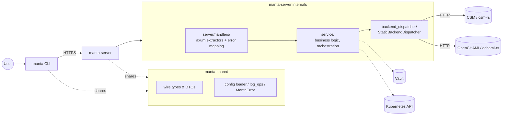
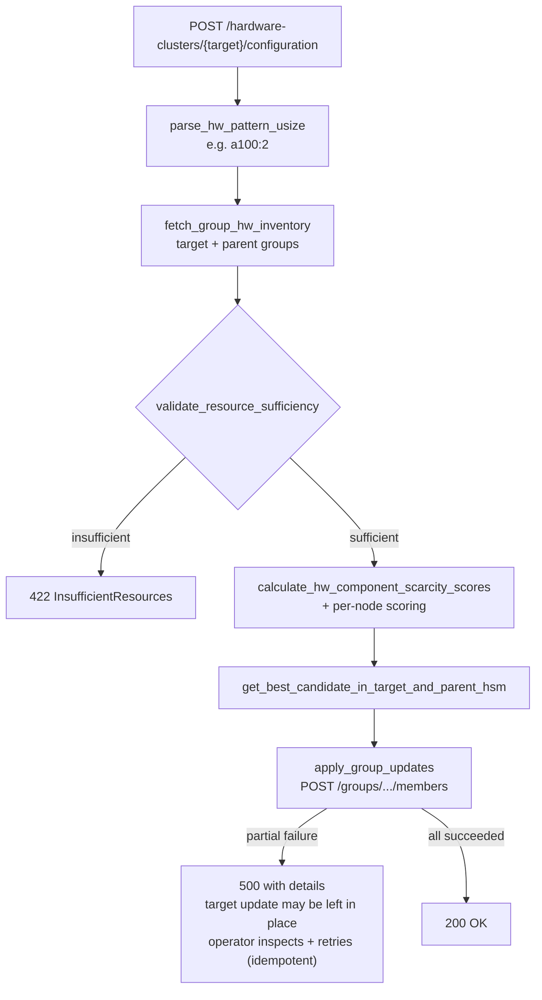
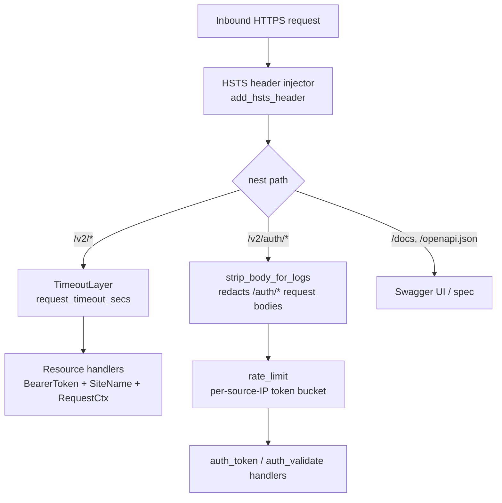

# Manta Architecture

This document describes the internal structure of the manta codebase for contributors.

---

## Workspace layout

manta is a Cargo workspace with three member crates:

```
manta/
├── Cargo.toml                       (workspace manifest)
└── crates/
    ├── manta-shared/   (lib)        — wire types, common helpers (config loader, MantaError, logging)
    ├── manta-cli/      (bin)        — terminal client, depends on manta-shared
    └── manta-server/   (bin)        — Axum HTTPS server + service layer, depends on manta-shared
```

Dep graph: `manta-cli → manta-shared ← manta-server`. Neither binary depends on the other, so each can be built and shipped on its own (`cargo build -p manta-cli` / `cargo build -p manta-server`).

A fourth directory, `crates/manta-cache/`, exists in the tree but is **not** a workspace member and holds no code — only `README.md`, `ROADMAP.md`, and a test fixture for a planned site-resolution cache. The implementation lives on the unmerged `manta-cache-stage-1-2` branch (PR #111); nothing on `main` builds, links, or calls it. Treat it as design docs until that PR lands.

`manta-shared` exposes two top-level modules:

| Module | Used by | Contents |
|--------|---------|----------|
| `types` | both bins | Wire types (`params/`, `dto`, `auth`) and `cluster_status` helpers |
| `common` | both bins | Config loader (untyped `Config`), `MantaError`, logging |

The backend bridge (`StaticBackendDispatcher` enum and the trait-impl blocks routing to `csm-rs`/`ochami-rs`, plus the `authorization` helpers that take a `&StaticBackendDispatcher`) lives in **`manta-server` only** (`crates/manta-server/src/backend_dispatcher/mod.rs`, `dispatcher.rs`, `service/authorization.rs`). The CLI never reaches them.

`manta-cli` keeps its CLI-only modules under `crates/manta-cli/src/common/` (e.g. `app_context::AppContext`, `config::CliConfiguration`, `authentication`, `hooks`, `confirm`, `multi_line`); the SAT-file Jinja renderer lives next to its caller at `crates/manta-cli/src/dispatch/apply/sat_file/render.rs`. `manta-server` keeps cross-tier helpers under `crates/manta-server/src/server/common/` (`app_context::InfraContext`, `audit`, `jwt_ops`, `kafka`, `vault`) and its typed server config schema at `crates/manta-server/src/config.rs`. The bulk of service-tier orchestration (`node_ops`, `authorization`, `ims_ops`, `boot_parameters`, plus the `hw_cluster` family) lives under `crates/manta-server/src/service/`.

---

## Layer overview


```mermaid
flowchart LR
  User((User)) --> CLI[manta CLI]
  CLI -->|HTTPS| Server[manta-server]
  CLI -. shares .-> Shared
  Server -. shares .-> Shared

  subgraph Shared[manta-shared]
    direction TB
    Wire[wire types & DTOs]
    Common[config loader / log_ops / MantaError]
  end

  subgraph ServerInternals[manta-server internals]
    direction TB
    Handlers[server/handlers/<br/>axum extractors + error mapping]
    Service[service/<br/>business logic, orchestration]
    Dispatcher[backend_dispatcher/<br/>StaticBackendDispatcher]
    Handlers --> Service --> Dispatcher
  end

  Server --> ServerInternals
  Dispatcher -->|HTTP| CSM[(CSM / csm-rs)]
  Dispatcher -->|HTTP| OCHAMI[(OpenCHAMI / ochami-rs)]
  Service -.-> Vault[(Vault)]
  Service -.-> K8s[(Kubernetes API)]
```

Both binaries share `manta-shared`. The CLI does not link the service layer, axum, csm-rs, or ochami-rs; the server owns the entire backend bridge. Pure helpers in `manta-shared` (e.g. SAT-file Jinja2 rendering) are used by the CLI; SAT-file processing (the `serde_json::Value`-walking `image_only`/`session_template_only` filter, the topological sort by `base.image_ref`, and the dispatch loop that POSTs one element at a time to per-section endpoints) lives in `manta-cli`'s `apply_sat_file::plan` / `apply_sat_file::dispatch` modules. The server is a pass-through for each SAT entry. There is no server-side pre-flight validation: `POST /sat-file/validate` was removed in `f9160d26` along with the backend's `SatTrait::validate_sat_file`, and nothing replaced it — cross-reference checking (dangling `image_ref`, cycles) runs client-side in `plan`, and everything else surfaces on the first per-element call. Each `images[]` entry is further driven as a three-step sub-pipeline (`apply_sat_file::image_pipeline`): create CFS session → monitor (status poll or SSE log stream depending on `--watch-logs`) → stamp `manta.image_session.*` onto the produced IMS image. The canonical SAT-file schema lives in csm-rs — the CLI carries each SAT element as a `serde_json::Value` end-to-end and never embeds the typed struct shape.

---

## Entry points

Each binary has its own `main.rs`:

### `crates/manta-cli/src/main.rs`

Startup runs in two phases:

1. **Single-threaded phase** — parse CLI args, load `cli.toml` from the platform config directory (Linux: `~/.config/manta/cli.toml` or `$XDG_CONFIG_HOME/manta/cli.toml`; macOS: `~/Library/Application Support/local.cscs.manta/cli.toml`) into a `CliConfiguration`. If the optional top-level `socks5_proxy` is set, export `SOCKS5` so `reqwest` picks it up for connections to manta-server.
2. **Multi-threaded phase** — start the tokio runtime, build an `AppContext` (site name, manta-server URL, default HSM group, timeout/poll knobs, raw settings) and hand it to `dispatch::process::process_cli`, which runs the read-only gate → token cascade → `SessionContext` build before routing to the verb. The CLI never instantiates `StaticBackendDispatcher` — every backend operation goes through `MantaClient` HTTPS calls to manta-server, and it emits no audit events of its own (that is server-side only).

### `crates/manta-server/src/main.rs`

Mirrors the CLI bootstrap, then starts the HTTPS server. Minimal Clap surface: `--port`, `--cert`, `--key`, `--listen-address`, `--allow-http` (opt out of the fail-closed TLS requirement when TLS terminates upstream; OR-ed with `[server].allow_http` from `server.toml`), `--emit-openapi` (dump the spec to stdout and exit — this is what regenerates `crates/manta-cli/openapi.json`). The `manta serve` subcommand has been removed from the CLI; users invoke `manta-server` directly.

---

## Layer responsibilities

### `crates/manta-cli/src/`

Presentation layer. Responsibilities:

- **`build/`** — Clap command and subcommand definitions, split per verb (`add.rs`, `apply.rs`, `backup.rs`, `config.rs`, `console.rs`, `delete.rs`, `gen_autocomplete.rs`, `gen_man.rs`, `get.rs`, `log.rs`, `migrate.rs`, `power.rs`, `restore.rs`, `run.rs`, `upgrade.rs`); `mod.rs` keeps the top-level `build_cli()` plus a few shared helpers (`output_flag`, `HOSTLIST_HELP`).
- **`dispatch/`** — Routing **and** execution; there is no separate `handlers/` directory in the CLI. `dispatch/process.rs` is the root dispatcher: for every invocation it runs the read-only gate, then (for authenticated verbs) the auth-token cascade (`get_api_token`) and the `SessionContext` build, then matches the top-level verb and calls the verb module. One subdirectory per verb (`add/`, `apply/`, `backup/`, `config/`, `console/`, `delete/`, `get/`, `migrate/`, `power/`, `restore/`, `run/`), each containing one file per noun (`dispatch/get/sessions.rs` implements `manta get sessions`, etc.) exporting `pub async fn exec(...)`; the verb's `mod.rs` holds the noun match arms. Verbs with no nouns live as single files directly under `dispatch/` (`gen_autocomplete.rs`, `gen_man.rs`, `log.rs`, `upgrade.rs`). `apply/sat_file/` is itself a sub-tree (`render`, `plan`, `dispatch`, `exec`).
- **`openapi_client.rs`** — a doc header and a single `include!(concat!(env!("OUT_DIR"), "/openapi_client.rs"))`. The body is a typed `reqwest` client generated at build time by `build.rs` (progenitor 0.14) from `crates/manta-cli/openapi.json`, so it never appears in the source tree or in `cargo publish` output. See [Generated code](#generated-code).
- **`http_client/`** — `MantaClient`, a thin wrapper over the generated client. `client.rs` holds the struct, `from_app_ctx` constructor, the `openapi` field (the progenitor `Client`), and `OpenApiResultExt::into_anyhow` which turns a progenitor result into `anyhow`; `wire.rs` handles URL-scheme rewriting + curl debug + JSON-secret redaction; `console.rs` and `streaming.rs` hold the two hand-rolled endpoint families (WebSocket console, SSE logs). There are **no** per-resource sub-modules here any more — a plain JSON endpoint is reached as `client.openapi.<operation_id>(...)`, not via a hand-written method. Handlers call it as:

  ```rust,ignore
  let client = MantaClient::from_app_ctx(ctx, Some(token))?;
  let groups = client.openapi
    .get_groups(params.group_name.as_deref(), client.site_name())
    .await
    .into_anyhow().await?;
  ```
- **`output/`** — Per-resource table + JSON renderers (`group.rs`, `session.rs`, `node.rs`, `hardware.rs`, …) plus `action_result.rs` (generic side-effect renderer used by every mutating command).
- Output formatting via `comfy-table` for terminal tables.
- Interactive prompts via `dialoguer`.
- Error handling via `anyhow::Error`; CLI handlers terminate with `eprintln!` + `process::exit()`.

CLI code **must not** contain business logic. It calls service functions with typed parameters and formats their results.

### `crates/manta-server/src/service/`

Business logic layer, one module per domain: `analysis`, `auth`, `authorization`, `boot_parameters`, `cluster`, `configuration`, `console`, `ephemeral_env`, `group`, `hardware`, `hw_cluster/`, `image`, `kernel_parameters`, `migrate`, `node`, `node_details`, `power`, `redfish`, `runtime_configuration`, `sat_file`, `sat_groups`, `session`, `template`, plus the cross-cutting helpers `ims_ops`, `node_ops`, and `infra_backend`.

**Service code calls the backend traits directly** — `infra.backend.<method>(...)`, importing the trait it needs. `infra_backend.rs` is *not* a wrapper layer: it is two dispatcher-meta methods on `InfraContext` (`backend_kind()` for tracing labels, `backend_clone()` for owned dispatchers inside `'static`-bound spawned tasks). An earlier revision did host per-domain wrappers there; they were deliberately removed to cut an abstraction layer, so don't reintroduce one when adding a backend call.

Each module receives an `&InfraContext<'_>` plus a bearer token and typed parameters, and returns typed results. This layer:

- Orchestrates multi-step operations (e.g. create config → build image → create session).
- Applies filtering, sorting, and business rules.
- Uses `manta_backend_dispatcher::error::Error` (not `anyhow`).
- Has no knowledge of terminal output or HTTP request/response shapes.

### `crates/manta-server/src/backend_dispatcher/`

Trait implementation glue. `mod.rs` owns the shared imports plus the `dispatch!` macro and declares one sibling file per backend trait (`apply_hw_cluster_pin.rs`, `apply_session.rs`, `authentication.rs`, `boot_parameters.rs`, `cfs.rs`, `cluster_session.rs`, `cluster_template.rs`, `component.rs`, `component_ethernet_interface.rs`, `console.rs`, `delete_configurations.rs`, `get_images.rs`, `group.rs`, `hardware_inventory.rs`, `ims.rs`, `migrate_backup.rs`, `migrate_restore.rs`, `pcs.rs`, `redfish_endpoint.rs`, `sat.rs`). Each sibling holds a single `impl ... for StaticBackendDispatcher` block; the `dispatch!` macro expands to a `match` that routes each method call to either the `CSM` or `OCHAMI` variant. Server-only — the CLI never reaches this code.

### `crates/manta-server/src/dispatcher.rs`

Defines the `StaticBackendDispatcher` enum:

```rust
pub enum StaticBackendDispatcher {
    CSM(Csm),
    OCHAMI(Ochami),
}
```

`StaticBackendDispatcher::new(backend_type, base_url, root_cert)` reads the `backend` field from the site config and constructs the appropriate variant.

### `crates/manta-shared/src/common/`

Genuinely bi-binary helpers:

| Module | Purpose |
|--------|---------|
| `config/` | Load `cli.toml` / `server.toml` — returns an untyped `::config::Config`; each binary deserialises into its own typed schema (`CliConfiguration` in `manta-cli`, `ServerConfiguration` in `manta-server`) |
| `error` | `MantaError` enum — error type for pure helpers (no backend-dispatcher dep) |
| `log_ops` | Logger initialisation; both binaries call `log_ops::configure(...)` on startup |
| `jwt_ops` | JWT **claim extraction** for the audit + authorization paths. Canonical home since the move out of the server; `crates/manta-server/src/server/common/jwt_ops.rs` is now a thin `pub use` shim kept so existing call sites resolve — new code should use `manta_shared::common::jwt_ops` directly. **These helpers do not verify the JWT signature** (see [Security model](#security-model)). |

CLI-only modules live under `crates/manta-cli/src/common/` (`app_context::AppContext`, `authentication`, `clap_ext` ArgMatches extension trait, `config::CliConfiguration`, `confirm` y/n prompt, `hooks` pre-/post-hook runner, `multi_line` table-cell wrapper, `read_only` local mutating-verb gate, `session::SessionContext` per-invocation JWT + reachable-groups snapshot). The SAT-file Jinja renderer + the run-session local-git-repo helpers live next to their callers at `crates/manta-cli/src/dispatch/apply/sat_file/render.rs` and `crates/manta-cli/src/dispatch/run/session/local_git_repo.rs`. Server-only helpers live under `crates/manta-server/src/server/common/` (`app_context::InfraContext`, `audit`, `kafka`, `vault`, plus `jwt_ops` — a re-export shim over `manta_shared::common::jwt_ops`); the typed `ServerConfiguration` sits at `crates/manta-server/src/config.rs`. Modules that orchestrate backend calls (`authorization`, `node_ops`, `ims_ops`, `boot_parameters`, `hw_cluster::hw_inventory_utils`) live under `crates/manta-server/src/service/` since they're service-tier logic, not handler helpers.

### `crates/manta-server/src/server/`

Axum HTTPS server. Key files:

| File | Purpose |
|------|---------|
| `mod.rs` | `start_server` — binds TLS, builds router, logs to stderr when the socket is ready to accept connections |
| `routes.rs` | Registers REST endpoints (including the two `/v2/auth/*` endpoints) + 2 WebSocket upgrades under `/v2/`; serves `GET /openapi.json` and `GET /docs` |
| `handlers/` | Module tree: parent `mod.rs` (extractors `BearerToken`/`SiteName`/`RequestCtx`, `ErrorResponse` + `to_handler_error`, guard helpers, `/health`) plus per-resource sub-modules (analysis, auth, boot_parameters, cluster, configuration, console, ephemeral_env, group, hardware, hw_cluster, image, kernel_parameters, migrate, node, power, redfish_endpoints, runtime_configuration, sat_file, session, template). External callers reference `handlers::X` unchanged via `pub use <module>::*` re-exports. |
| `api_doc.rs` | `ApiDoc` struct — assembles the OpenAPI 3.0 spec from all `#[utoipa::path]` annotations; adds `bearerAuth` security scheme and `/v2` server base path |

The `manta-server` crate is **both a library and a binary**. `crates/manta-server/src/lib.rs` declares six top-level modules as `pub mod` (`backend_dispatcher`, `config`, `dispatcher`, `server`, `service`, `wire_conv`); the server-only `common` modules live one level deeper as `server::common`. `src/main.rs` is a thin bootstrap that calls into the library. Integration tests in `crates/manta-server/tests/` (`server_routes.rs`, `integration.rs`) import via `use manta_server::...` — they exercise the public API in a separate compilation unit per Rust convention. The crate lints `#![warn(missing_docs)]`; CI's `cargo doc` step still surfaces undocumented public items.

`crates/manta-server/src/wire_conv.rs` holds backend⇄wire-type conversions that can't live in either `manta-shared` or `manta-backend-dispatcher` due to Rust's orphan rule. Currently a single free function `to_backend(MantaError) → BackendError`, used at server call sites that propagate `manta-shared`'s `MantaError` via `?`.

`ServerState` (wrapped in `Arc`) owns all infrastructure: backend dispatcher, TLS certificates, optional Vault/k8s URLs.

### Hardware-cluster pin/unpin algorithm

The algorithm has a fixed phase shape: parse the requested hardware pattern, fetch the target + parent group inventory, score candidate nodes, move the winners. Failures during the move phase are **not** rolled back — the design relies on target-group updates being idempotent and on operators retrying. See the rollback-contract rustdoc in `crates/manta-server/src/service/hw_cluster/pin_unpin.rs` for the per-step guarantees.

*Flowchart: phase shape of `apply hw-cluster` from CLI to backend.*


```mermaid
flowchart TD
    Req["POST /hardware-clusters/{target}/configuration"] --> Parse["parse_hw_pattern_usize<br/>e.g. a100:2"]
    Parse --> Fetch["fetch_group_hw_inventory<br/>target + parent groups"]
    Fetch --> Validate{validate_resource_sufficiency}
    Validate -->|insufficient| Err422["422 InsufficientResources"]
    Validate -->|sufficient| Score["calculate_hw_component_scarcity_scores<br/>+ per-node scoring"]
    Score --> Pick["get_best_candidate_in_target_and_parent_hsm"]
    Pick --> Move["apply_group_updates<br/>POST /groups/.../members"]
    Move -->|partial failure| Err5xx["500 with details<br/>target update may be left in place<br/>operator inspects + retries (idempotent)"]
    Move -->|all succeeded| Done["200 OK"]
```

---

## Context objects

| Type | Used by | Contents |
|------|---------|---------|
| `InfraContext<'_>` | Service layer (server-only, in `crates/manta-server/src/server/common/app_context.rs`) | Backend dispatcher, site name, shasta + gitea base URLs, root CA cert, optional vault + k8s URLs (7 borrowed fields) |
| `AppContext<'_>` | CLI layer (in `crates/manta-cli/src/common/app_context.rs`, flat 13-field struct) | `site_name`, `manta_server_url`, `settings_group_name_opt`, `request_timeout_secs`, `power_poll_interval_secs`, `power_max_poll_attempts`, `sat_file_poll_interval_secs`, `sat_file_poll_budget_secs`, `sat_file_not_visible_budget_secs`, `read_only`, `settings`, plus two fields populated by `process_cli` rather than by `cli.toml`: `token` (the resolved bearer token) and `session` (`Option<SessionContext>` — JWT-derived facts + one `GET /groups/available`, cached for the command's lifetime so no handler re-runs the auth cascade). The poll/budget knobs are user-tunable from `cli.toml` and feed the dispatcher's compiled defaults when unset. |
| `Arc<ServerState>` | HTTP server | Infrastructure behind a reference-counted pointer; each handler calls `.infra_context()` |

`manta_server_url` is a CLI routing decision — proxy requests through the manta HTTP server instead of calling the backend directly. It is not needed by the service layer or the HTTP server.

---

## Configuration files

Manta reads two TOML files, one per binary. The config directory is platform-resolved (via the `directories` crate):

- **Linux:** `$XDG_CONFIG_HOME/manta/` if set, otherwise `~/.config/manta/`
- **macOS:** `~/Library/Application Support/local.cscs.manta/`

| Binary | File | Env override |
|---|---|---|
| `manta-cli` | `cli.toml` | `MANTA_CLI_CONFIG` |
| `manta-server` | `server.toml` | `MANTA_SERVER_CONFIG` |

The two schemas are disjoint:

| Schema | Fields |
|---|---|
| `CliConfiguration` | `log`, `site` (active), top-level `manta_server_url`, optional top-level `socks5_proxy`, optional top-level `request_timeout_secs`. **No `[sites]` map** — CLI only knows about the one manta-server it talks to. The legacy `parent_hsm_group` field was removed (see MIGRATING.md §5.7); the CLI uses `hsm_group` as the default group key. |
| `ServerConfiguration` | `log`, `[server]` (TLS, listen, console timeout, auth rate limit), `auditor`, `sites: HashMap<String, Site>` (per-site backend, URLs, root cert, optional `[sites.X.k8s]` block). |

The server has no notion of an "active" site — it hosts every entry in its `sites` table simultaneously, and clients select per-request via the `X-Manta-Site` header. The CLI puts that header on every request based on its own `site = "..."` (overridable with `--site`).

Loaders live in `manta-shared::common::config`: `get_cli_configuration()` and `get_server_configuration()`. Both fail fast with `MantaError::NotFound` if the file is missing; the error message includes a minimal sample and (if a legacy unified `config.toml` is detected in the same config directory) a field-by-field migration mapping. There is no auto-create wizard and no migration subcommand.

## Backend selection

CLI side — pick the active site (just a header value):

```toml
# cli.toml
site             = "cscs_prod"   # X-Manta-Site header on every request
manta_server_url = "https://manta-server.cscs.ch:8443"
```

Server side — every entry in `[sites.*]` becomes a `StaticBackendDispatcher` at startup; client requests select between them via `X-Manta-Site`:

```toml
# server.toml
[sites.cscs_prod]
backend           = "csm"        # or "ochami"
shasta_base_url   = "https://api.cscs.ch"
root_ca_cert_file = "cscs_root_cert.pem"

[sites.local_ochami]
backend           = "ochami"
shasta_base_url   = "https://foobar.openchami.cluster:8443"
root_ca_cert_file = "ochami_root_cert.pem"
```

`StaticBackendDispatcher::new` reads the `backend` string and constructs `CSM(...)` or `OCHAMI(...)`.

---

## CLI mode vs HTTP server mode

| Aspect | CLI | HTTP server |
|--------|-----|-------------|
| Entry point | `dispatch::process::process_cli` | `server::start_server` |
| Auth source | `MANTA_CSM_TOKEN` env var → cached local file → interactive Keycloak prompt (via `POST /v2/auth/token`) | `Authorization: Bearer` header, per request |
| Context type | `AppContext` (flat 13-field struct in manta-cli) | `Arc<ServerState>` → `infra_context()` |
| Error handling | `eprintln!` + `process::exit()` | JSON `{"error": "..."}` with HTTP status code |
| Output | Terminal tables / stdout | JSON response body |
| Streaming | stdout | SSE (`/sessions/{name}/logs`) or WebSocket (`/nodes/{xname}/console`) |
| Error type | `anyhow::Error` | `manta_backend_dispatcher::error::Error` |

---

## Error handling conventions

Three error types, partitioned by layer (the backend-dispatcher rule is enforced by CI):

- **`manta_backend_dispatcher::error::Error`** (`BackendError`) — used in `manta-server`'s service layer and handler boundary (`crates/manta-server/src/{server,service,backend_dispatcher,dispatcher.rs}`).
- **`manta_shared::common::error::MantaError`** — used by `manta-shared`'s pure helpers (config loader). Also raised by binary-side helpers that depend on it (`manta-cli`'s sat-file Jinja renderer, `manta-server`'s `audit`/`jwt_ops`/`kafka`). Lets manta-shared have no compile-time dependency on backend-dispatcher's error surface. Converted to `BackendError` at server call sites via `crates/manta-server/src/wire_conv.rs::to_backend(MantaError) -> BackendError`.
- **`anyhow::Error`** — allowed only in `crates/manta-cli/src/` handlers and CLI-only helpers.

The HTTP server converts typed errors to HTTP status codes via `to_handler_error` in `crates/manta-server/src/server/handlers/mod.rs`.

When a handler error reaches `to_handler_error` or `serialize_or_500`, the log line walks the `std::error::Error::source()` chain (`format_with_causes`) and emits each level prefixed with `caused by:`. `thiserror`'s `Display` only renders the top-level `#[error("…")]` string, so without this walk `#[from]`-wrapped inner errors (`reqwest::Error`, `serde_json::Error`, etc.) would be lost. The HTTP response body still carries only the top-level message to avoid leaking internals to clients.

---

## Observability

Logging is initialised by `manta_shared::common::log_ops::configure(log_level, with_timestamps)`. Both binaries share the function but differ on one flag:

| Binary | `with_timestamps` | Rationale |
|--------|--------------------|-----------|
| `manta-server` | `true` | Long-running process; ISO-8601 timestamps help correlate events across requests in `journalctl` / file logs. |
| `manta-cli` | `false` | Interactive use; timestamps clutter terminal output. |

The filter directive comes from `[log]` in `cli.toml` / `server.toml` (e.g. `"info"`, `"manta=debug,hyper=warn"`); invalid directives fall back to `"error"`. Targets are suppressed (`with_target(false)`); the `target=` field would just repeat the module path that's already visible from the message.

---

## Security model

`manta-server` is a **credential-handling endpoint**: the CLI POSTs Keycloak username/password to `POST /v2/auth/token`, and the server proxies them to the configured backend (CSM or OCHAMI) via `service::auth::get_api_token`. The CSM bearer token comes back to the CLI; subsequent authenticated endpoints use it via `Authorization: Bearer`.

After Phase 7, the CLI never constructs `StaticBackendDispatcher` and never calls a backend trait method at runtime. Every CLI command (including auth, group-listing, and the previously-direct `apply_session` / `add hardware` / `migrate nodes` / `config_*` paths) goes through `MantaClient`. `AppContext` is a flat 13-field struct of CLI-side knobs (site, server URL, default group, read-only flag, tuneable request and poll timeouts) plus the per-invocation token and `SessionContext`; the server holds all real infra (TLS, backend dispatcher, Vault, k8s).

Server-side authorization helpers live in `service::authorization`:

- `validate_user_group_access` / `validate_user_group_vec_access` — the target group label(s) must be in the set the token can reach.
- `validate_user_group_members_access` — every xname in the request must be a member of an accessible group.
- `validate_ansible_limit_membership_access` — the same membership check applied to a comma-separated `ansible_limit` string.

Those helpers read the caller's roles and groups out of the bearer token via `manta_shared::common::jwt_ops`, which **decodes claims without verifying the JWT signature**. That is sound only because every authorized path still makes a backend round-trip, and CSM/OpenCHAMI verifies the signature there — a forged token is rejected at the first real call. The rule this imposes: **never add a code path that acts on a JWT claim and returns before the backend call happens** (a local cache, a short-circuit, a handler that only consults local roles). `is_user_admin` is exactly such a short-circuit, so any new use of it must still be followed by a backend call.

Admin tokens (carrying the `PA_ADMIN` Keycloak role) short-circuit every check. Handlers that operate on a single backend-issued identifier (e.g. `delete_node`, `delete_session`, `add_boot_parameters`) currently rely on backend-side ACLs rather than these helpers; treat any new privileged handler as a candidate for adding the appropriate check.

**The CLI's `read_only` flag is not a security control.** `cli.toml`'s `read_only = true` makes `dispatch::process::process_cli` refuse every backend-mutating verb (`add` / `apply` / `backup` / `delete` / `migrate` / `power` / `restore` / `run`) before any HTTP request leaves the process — see `crates/manta-cli/src/common/read_only.rs` (`read_only_gate`, `MUTATING_VERBS`). It is a local foot-gun guard, toggled with `manta config set|unset read-only`; a mutating verb invoked with `--dry-run` is let through (`dry_run_set`). There is **no** server-side counterpart, and anyone can flip their own config or call the API directly. When adding a **new top-level verb**, classify it: `MUTATING_VERBS` is an explicit list, and a unit test in that module asserts `build_cli()`'s subcommand set equals `MUTATING_VERBS ∪ READ_ONLY_VERBS`, so an unclassified verb fails `cargo test`, not review.

The wire-type coupling that survived Phase 7 has since been cleaned up: `csm-rs` and `ochami-rs` are gone from `manta-cli`'s transitive deps. `manta-shared::types::dto` now defines a local `NodeDetails` mirror (identical JSON wire shape) instead of re-exporting csm-rs's. `manta-shared::common::error::MantaError` replaced `manta_backend_dispatcher::error::Error` in the pure helpers. The lightweight `manta-backend-dispatcher` crate still appears transitively in the CLI's dep tree for `dto.rs`'s remaining type re-exports (`Group`, `NodeSummary`, `BosSessionTemplate`, `BootParameters`, `CfsConfigurationResponse`, `CfsSessionGetResponse`, `Image`); mirroring those too is a deferred trade-off (~700 LOC vs perpetual mirror maintenance).

This means manta-server is a **single point of compromise** for everyone using it: if it is owned, the attacker gets a chokepoint that sees every auth attempt and holds whatever service-account scoped tokens are configured for the backend. Mitigations split between code and ops:

| Layer | Where | Notes |
|---|---|---|
| Per-source-IP rate limit on `/v2/auth/*` | code | `[server].auth_rate_limit_per_minute` (default 60). Implementation in `server::auth_middleware::rate_limit`. |
| Generic 401 on every auth failure | code | `server::handlers::auth_token` returns the same `"invalid credentials"` body regardless of whether the user was unknown or the password was wrong. Detail stays in server-side `tracing::warn!`. |
| Audit event per auth attempt | code | `manta_server::server::common::audit::send_auth_audit` emits `{ outcome, username, source_ip, site }` to the configured Kafka producer. Credentials are never logged. |
| Body redaction on `/auth/*` log spans | code | `server::auth_middleware::strip_body_for_logs`. |
| TLS termination, WAF, reverse-proxy rate limit | **ops** | First line of defence; manta-server's in-process limiter is belt-and-braces. |
| Service-account scoping at CSM / Vault | **ops** | Limit what the manta-server-issued tokens can do at the backend. |
| Network segmentation | **ops** | Treat manta-server as a privileged host. |

### Middleware layer stack

Tower applies layers in **reverse-add order** — the last `.layer()` becomes the outermost middleware. The order below is what an inbound request crosses, top to bottom.

*Flowchart: where each control sits on the two sub-routers.*


```mermaid
flowchart TD
    Req[Inbound HTTPS request] --> HSTS[HSTS header injector<br/>add_hsts_header]
    HSTS --> Split{nest path}

    Split -->|/v2/*| Tmo[TimeoutLayer<br/>request_timeout_secs]
    Tmo --> Hdlr[Resource handlers<br/>BearerToken + SiteName + RequestCtx]

    Split -->|/v2/auth/*| StripBody[strip_body_for_logs<br/>redacts /auth/* request bodies]
    StripBody --> RL[rate_limit<br/>per-source-IP token bucket]
    RL --> AuthH[auth_token / auth_validate handlers]

    Split -->|/docs, /openapi.json| Swagger[Swagger UI / spec]
```

The diagram captures three facts that trip up new contributors: the nest split between `/v2/*` and `/v2/auth/*`, the last-added-outermost layer ordering on each sub-router, and which defences live on which path.

**Deferred:** forwarding the original client IP to Keycloak via `X-Forwarded-For` on the upstream auth call. The current `AuthenticationTrait::get_api_token` signature in `manta-backend-dispatcher` does not take a header argument, so this would require a sibling-repo upgrade (csm-rs + ochami-rs). Tracked as a follow-up.

---

## Request timeouts

A single `tower_http::timeout::TimeoutLayer` lives in `crates/manta-server/src/server/routes.rs::build_router`, applied to every API route, configured from `[server].request_timeout_secs` (default 600s). When the timer fires, axum returns `408 REQUEST_TIMEOUT`.

There's no per-route override on the server. Long-running work runs CLI-side:

- **Power transitions:** `POST /power` returns immediately with the PCS transition id; the CLI polls `GET /power/transitions/{id}` every 3s (matching csm-rs's historical poll interval) until the transition reports `completed`. See `crates/manta-cli/src/dispatch/power/mod.rs::poll_until_done`.
- **SAT-file apply:** the CLI dispatches the execution plan one element at a time to per-section endpoints (see [SAT files](API.md#sat-files)). Each per-element call fits well under the default timeout. Image builds are further split into discrete create-session / monitor / stamp HTTP calls, so the long-running CFS session work never blocks a single request — the monitor loop runs in the CLI.

The CLI honours `cli.toml`'s optional `request_timeout_secs` via `MantaClient::from_app_ctx(&AppContext<'_>)` — every dispatch path threads it through. When unset, the one-shot REST client defaults to 300 s and the streaming client (SSE log tail, WebSocket console) applies no timeout; when set, both clients use the supplied value. The poll/budget knobs on `AppContext` (`power_*`, `sat_file_*`) cover the CLI-side wait loops that sit outside any single HTTP call.

---

## Key external dependencies

| Crate | Role |
|-------|------|
| `csm-rs` | HTTP client for HPE Cray System Management APIs: CFS, BOS, HSM, IMS, PCS |
| `ochami-rs` | HTTP client for OpenCHAMI APIs: BSS, SMD |
| `manta-backend-dispatcher` | Trait definitions, shared types, shared error enum |
| `axum` + `axum-server` | HTTPS server with TLS via rustls |
| `utoipa` + `utoipa-swagger-ui` | OpenAPI 3.0 spec generation and Swagger UI serving |
| `clap` | CLI argument parsing |
| `tokio` | Async runtime |
| `minijinja` | Jinja2 template rendering for SAT file processing |
| `rdkafka` | Kafka producer for operation audit trail |
| `git2` | Local git repository operations (repo validation, CFS layer source) |
| `config` | TOML config file loading with environment variable overrides |
| `dialoguer` | Interactive terminal prompts (confirmations, selection lists) |
| `comfy-table` | Terminal table output |
| `reqwest` | HTTP client used by csm-rs and ochami-rs |

---

## Generated code

Three checked-in artifacts are produced by tooling, never hand-edited, and gated in CI (see `.github/workflows/ci.yml`, "Verify generated artifacts are up to date"). They drift on **different** triggers, so it is easy to refresh one and forget the other:

| Artifact | Produced by | Drifts when you change | Regenerate with |
|---|---|---|---|
| `crates/manta-cli/openapi.json` | `manta-server`'s utoipa annotations | a `#[utoipa::path]`, a route, a wire-type shape/doc, **or the workspace version** (`info.version` tracks `CARGO_PKG_VERSION`) | `cargo run -p manta-server -- --emit-openapi > crates/manta-cli/openapi.json` |
| `crates/manta-cli/man/` | `crates/manta-cli/build.rs` from the clap surface | anything under `crates/manta-cli/src/build/` | `MANTA_REGENERATE_DOCS=1 cargo build -p manta-cli` |
| `crates/manta-cli/autocomplete_shell_scripts/` | same | same | same |

`openapi.json` is **not just documentation** — it is a build input. `crates/manta-cli/build.rs` runs progenitor 0.14 over it and emits a typed `reqwest` client into `$OUT_DIR/openapi_client.rs`, which `src/openapi_client.rs` `include!`s. A stale spec therefore means the CLI compiles against the wrong API shape, not merely that the docs are behind. (The spec is down-converted from OpenAPI 3.1 to 3.0 in `build.rs` first, because progenitor's `openapiv3` only understands 3.0.)

Two endpoint families are deliberately excluded from the generated client and stay hand-written, because progenitor models neither WebSocket upgrades nor `text/event-stream` bodies:

- WebSocket consoles → `crates/manta-cli/src/http_client/console.rs`
- SSE log streaming → `crates/manta-cli/src/http_client/streaming.rs`

On a push to `main` CI regenerates all three and auto-commits with `[skip ci]`, so `main` self-heals; on a pull request it only fails. Commit the regenerated diff with your change.

---

## SOCKS5 proxy

Only the CLI has a first-class SOCKS5 knob — `cli.toml`'s optional top-level `socks5_proxy`. `main.rs` exports it as the `SOCKS5` env var during the single-threaded startup phase (before tokio starts, so `std::env::set_var` is safe), and the CLI's single `MantaClient` connection to `manta_server_url` is routed through it.

`manta-server` has no per-site SOCKS5 knob. It's expected to sit in a network position where the backend URLs (`shasta_base_url`, Vault, k8s) are directly reachable. Operators who need proxying can set `HTTPS_PROXY` / `ALL_PROXY` in the server's environment; there is no per-site override.

## Audit trail

Only `manta-server` emits Kafka audit events. Configuration lives under `[auditor.kafka]` in `server.toml` and currently covers `/v2/auth/*` attempts via `send_auth_audit`. Every CLI command goes through HTTP to the server, so the server-side request log + auth-audit stream together cover what the CLI used to record locally. The producer is a lazily-initialised `FutureProducer` in a `OnceLock`; messages are fire-and-forget with a 5-second timeout. Audit calls are made via `common::kafka`.

## Hooks

The CLI's `apply sat-file`, `backup vcluster`, and `restore vcluster` commands support optional `--pre-hook` / `--post-hook` flags pointing at arbitrary shell commands run before / after the operation. `common::hooks::run_hook` executes them via a subshell and returns `anyhow::Error` if the exit code is non-zero; `common::hooks::check_hook_perms` validates existence + executable bit up front so a typo'd path errors before the expensive work begins.

---

## Adding a new command

1. Create `crates/manta-cli/src/dispatch/<verb>/<noun>.rs` with `pub async fn exec(...)`. (For an entirely new verb, create the directory and a `mod.rs` re-exporting the noun modules.)
2. Register the noun module in `crates/manta-cli/src/dispatch/<verb>/mod.rs` (and the verb in `crates/manta-cli/src/dispatch/mod.rs` for a new verb), then add the clap subcommand definition to `crates/manta-cli/src/build/<verb>.rs`.
3. Add the dispatch arm in `crates/manta-cli/src/dispatch/<verb>/mod.rs`, which matches the clap subcommand and calls `dispatch::<verb>::<noun>::exec`. Argument extraction lives in the noun module itself (conventionally a `parse_*_params` helper, kept separate from `exec` so it is unit-testable against the production clap builder). For a brand-new verb, also add the arm to `crates/manta-cli/src/dispatch/process.rs`, which does the auth-token bootstrap and routes to each verb.
4. If the operation is non-trivial, implement the business logic as a public function in the appropriate `crates/manta-server/src/service/<module>.rs`.
5. If the operation needs a new backend call, add the method to the relevant trait in `manta-backend-dispatcher`, implement it in both `csm-rs` and `ochami-rs`, and add the dispatch arm to the corresponding `impl <Trait> for StaticBackendDispatcher` block in `crates/manta-server/src/backend_dispatcher/mod.rs`.
6. If the command should also be reachable via the HTTP API, add a handler in the appropriate `crates/manta-server/src/server/handlers/<resource>.rs` (with a `#[utoipa::path(...)]` annotation; `handlers/mod.rs` re-exports the resource module's public items, so the handler is automatically reachable as `handlers::<fn_name>`). Register the route in `crates/manta-server/src/server/routes.rs`, and add the path and any new schema types to the `#[openapi(...)]` derive in `crates/manta-server/src/server/api_doc.rs`.
7. **Regenerate the OpenAPI spec** — `cargo run -p manta-server -- --emit-openapi > crates/manta-cli/openapi.json`. This is not a docs chore: it is what makes the new endpoint appear as a method on the CLI's generated client (`client.openapi.<operation_id>(...)`), and CI rejects a PR whose spec is out of date. If you also touched anything under `crates/manta-cli/src/build/`, run `MANTA_REGENERATE_DOCS=1 cargo build -p manta-cli` too. See [Generated code](#generated-code).
8. If the new verb is a **top-level** verb, classify it in `crates/manta-cli/src/common/read_only.rs` (`MUTATING_VERBS` or the test-only `READ_ONLY_VERBS`) — a unit test fails otherwise.
