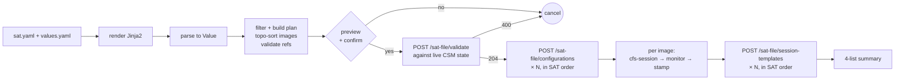
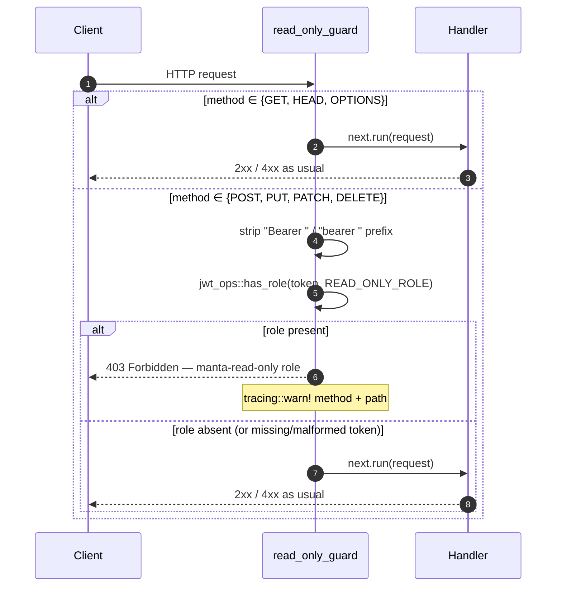

# Manta User Guide

> **Documentation version:** this guide describes **manta 2.0.0**. For an older release, browse the repository at the matching git tag (e.g. `v1.64.3` for the last v1 release).

Practical walkthroughs for common cluster management tasks. This guide assumes manta is already installed and configured. See [README.md](README.md) for deployment instructions.

## TL;DR

Task-oriented walkthroughs for the most common cluster-management workflows: checking cluster and node status, managing groups, deploying with SAT files, running CFS sessions from local git repos, manipulating boot and kernel parameters, power on/off/reset, console access, moving nodes between groups, cleaning up old configurations, multi-site setups, non-interactive scripting, and installing/upgrading the CLI itself. Sections are self-contained — jump to the one you need.

For the per-flag reference of every command, see [CLI.md](CLI.md). To call the HTTP API directly without going through the CLI, see [API.md](API.md).

---

## Table of contents

1. [Checking cluster status](#1-checking-cluster-status)
2. [Groups](#2-groups)
3. [Deploying with a SAT file](#3-deploying-with-a-sat-file)
4. [Running a CFS session from a local repo](#4-running-a-cfs-session-from-a-local-repo)
5. [Managing boot parameters](#5-managing-boot-parameters)
6. [Managing kernel parameters](#6-managing-kernel-parameters)
7. [Power management](#7-power-management)
8. [Console access](#8-console-access)
9. [Moving nodes between groups](#9-moving-nodes-between-groups)
10. [Cleaning up old configurations and images](#10-cleaning-up-old-configurations-and-images)
11. [Working with multiple sites](#11-working-with-multiple-sites)
12. [Non-interactive and scripted use](#12-non-interactive-and-scripted-use)
13. [Read-only access](#13-read-only-access)
14. [Installation maintenance](#14-installation-maintenance)

---

## 1. Checking cluster status

**List all groups:**

```bash
manta get groups
```

**Show nodes in a group with their current status:**

```bash
manta get group-nodes compute
manta get group-nodes compute -o summary          # counts per status
manta get group-nodes compute --status ON         # only powered-on nodes
```

**Get a flat list of xnames (useful for scripting):**

```bash
manta get group-nodes compute --xnames-only-one-line
```

**Check specific nodes:**

```bash
manta get nodes x3000c0s1b0n[0-7]
manta get nodes nid001313,nid001314 -o json
```

**Check recent CFS sessions:**

```bash
manta get sessions --group compute --status running
manta get sessions --most-recent
manta get sessions --limit 10 -o json
```

**Stream logs for the most recent session:**

```bash
manta log
```

---

## 2. Groups

In CSM (and OpenCHAMI), every node belongs to one or more **HSM groups** — named sets of node xnames maintained by the Hardware State Manager. Groups are the primary unit of targeting for almost everything manta does: power, boot params, kernel params, CFS sessions, SAT-file applies, and authorization.

**What an HSM group actually is.** A group is a named bucket of xnames (e.g. `compute`, `gpu-cluster`, `nodes_free`) carrying a `label` (the name used in commands), a `description`, and the explicit member list. Membership is explicit — a node is in the group iff its xname appears on the member list; there is no implicit membership by hardware shape or hostname pattern. A single node can belong to several groups at once. Groups don't own state beyond their membership and metadata: CFS configurations, BOS session templates, kernel/boot parameters, and IMS images live in their own systems and *reference* groups when relevant.

**How groups appear in manta commands.** Most read commands accept `-H/--group <name>` to scope a query — `manta get group-nodes compute`, `manta get sessions --group compute`, `manta get kernel-parameters --group compute`, `manta get boot-parameters --group compute`. Most write commands accept `--group <name>` to target every node in the group at once — `manta apply boot group compute`, `manta apply kernel-parameters "console=ttyS0" --group compute`, `manta power off group compute --graceful`. Each is shorthand for *"apply this change to every member of `compute`."* SAT files reference groups too: `session_templates[].bos_parameters.boot_sets[].node_groups` and `images[]` group selectors resolve against HSM groups by label, and the server's pre-flight (`POST /sat-file/validate`) checks that the caller is allowed to target every group the file mentions.

**Authorization scope.** The manta server only lets a caller act on the groups its bearer token is authorized for. The authoritative list comes from `GET /api/v1/groups/available`, which the server consults internally for SAT-file and session-template paths. Applying against a group your token can't reach fails with `403 Forbidden` *before* anything is changed. To see what your token can do:

```bash
manta get groups        # all groups visible to the server

# vs. the subset the server will let *this* token act on:
curl -sk -H "Authorization: Bearer $MANTA_TOKEN" \
  -H "X-Manta-Site: $MANTA_SITE" \
  "$MANTA_HOST/api/v1/groups/available"
```

**Default group from `cli.toml`.** A `hsm_group = "<name>"` line in `cli.toml` is used as the default whenever a command's `--group` flag is omitted, so e.g. `manta get sessions` becomes equivalent to `manta get sessions --group compute`. Set/unset it at any time:

```bash
manta config set hsm gpu-cluster
manta config unset hsm
```

The server-side `server.toml` has no equivalent — group names live in CSM/OCHAMI, not in manta's config.

**Conventional names.** There is no group *type* beyond "named bucket of xnames" — every group is structurally identical. A few names are conventional: `nodes_free` (or similar) is often used as a **pool** of unassigned nodes, and the hardware-pattern verbs treat it as the `--parent-group` (source) when moving nodes into a target group. Site-specific names (`compute`, `gpu-cluster`, `nid-001-064`, …) are just whatever the site decided to call them.

**Legacy term — "vCluster".** The old vCluster term was an alias for HSM group. Several flag spellings still accept the cluster wording as visible aliases (`--target-cluster`, `--parent-cluster`); see [CLI.md → Migrating from earlier shapes](CLI.md#migrating-from-earlier-shapes) for the full rename table. "Group" is the canonical term going forward.

### Group management commands

**Create a group:**

```bash
manta add group --label gpu-cluster --description "A100 GPU nodes"
```

**Create a group with initial members:**

```bash
manta add group --label gpu-cluster --nodes x3000c0s1b0n[0-7]
```

**Add nodes to an existing group:**

```bash
manta add nodes --group gpu-cluster --nodes x3000c0s9b0n[0-3]
```

**Remove nodes from a group:**

```bash
manta delete nodes --group gpu-cluster --nodes x3000c0s9b0n[0-3]
```

**Delete a group** (must be empty first):

```bash
manta delete nodes --group gpu-cluster --nodes x3000c0s1b0n[0-7]
manta delete group gpu-cluster
```

---

## 3. Deploying with a SAT file

The SAT file is the primary deployment mechanism. A SAT file is a YAML document with up to three top-level sections: `configurations`, `images`, and `session_templates`. (A `hardware` section is recognised by the SAT YAML spec but is not supported by the current apply flow.)

The CLI renders Jinja2, parses the SAT file into a structured value, applies the `-i` / `-s` filters locally (drops top-level sections + prunes unreferenced configurations / images), and builds an ordered execution plan — configurations first (in SAT order), then images topologically sorted by `base.image_ref`, then session_templates — *before* sending anything to the server. Dangling `image_ref` references and image cycles fail client-side. You'll see the **filtered SAT file printed as YAML for review** and be asked to confirm — and a second time if `--create-bos-session` is set and the file still contains any `session_templates` after filtering. Use `--assume-yes` to skip the prompts in non-interactive runs.

Once both confirms pass, the CLI calls `POST /sat-file/validate` to **pre-flight the whole file against live CSM state** — CFS configurations, IMS image references, and the `cray-product-catalog` ConfigMap are all checked. Validation failure aborts the run before the pre-hook fires, so no partial work happens. (The `hardware:` section is not checked here — see the note below.)

The CLI then dispatches the plan one element at a time, accumulating a `ref_name → image_id` lookup between calls so chained images and session_templates resolve. The final result is the same four-list summary (`configurations`, `images`, `session_templates`, `bos_sessions`) the user has always seen.

Image builds are driven as three discrete HTTP steps per image — the CLI creates the CFS session, monitors it (streaming logs with `--watch-logs` or polling status every 10s otherwise), and then asks the server to stamp the produced IMS image with `manta.image_session.*` provenance. This means progress is visible from the CLI in real time rather than blocking on one long server call.



For each image (in dependency order):

```mermaid
flowchart LR
  S[POST /sat-file/images/cfs-session<br/>creates CFS session] --> M{--watch-logs?}
  M -->|yes| L[GET /sessions/&#123;name&#125;/logs SSE]
  M -->|no| P[GET /sessions?name=…<br/>poll every 10s]
  L --> T[terminal status]
  P --> T
  T --> Z[POST /sat-file/images/stamp<br/>PATCH manta.image_session.&#42;]
```



**Full deployment** (build image, then apply to nodes):

```bash
manta apply sat-file -t cluster.yaml --watch-logs
```

**Using a Jinja2 template with a values file:**

```bash
manta apply sat-file -t cluster.yaml.j2 -f values.yaml --watch-logs
```

**Override individual Jinja2 values inline:**

```bash
manta apply sat-file -t cluster.yaml.j2 \
  -V image_version=2024.1 \
  -V ansible_repo=my-config \
  --watch-logs
```

**Build image only** (skip session_templates):

```bash
manta apply sat-file -t cluster.yaml -i --watch-logs
```

**Apply session templates only** (skip image build, use existing image):

```bash
manta apply sat-file -t cluster.yaml -s --create-bos-session
```

**Dry run to validate without making changes:**

```bash
manta apply sat-file -t cluster.yaml --dry-run
```

Combine with `--create-bos-session` to preview the BOS sessions that would be kicked off, without persisting them:

```bash
manta apply sat-file -t cluster.yaml --dry-run --create-bos-session
```

In that combination the server returns a **mock** BOS session per session_template — no status, name prefixed with `dry-run-` — so a casual reader of the output cannot mistake it for a real persisted CSM session.

**Run pre/post hooks:**

```bash
manta apply sat-file -t cluster.yaml \
  --pre-hook "echo Starting deployment" \
  --post-hook "notify-team.sh deployed"
```

> The post-hook only runs on success.

**Provenance metadata on built images:**

Every image built by `manta apply sat-file` is automatically annotated with the CFS facts that produced it, written to the IMS image's `metadata` map:

| Key | Value |
|-----|-------|
| `manta.image_session.base` | source/base image id the new image was built on top of |
| `manta.image_session.groups` | JSON-encoded array of HSM group names the image targets |
| `manta.image_session.configuration` | CFS configuration name that was applied |

These are written as an explicit step after the CFS session reaches a terminal-complete state: the CLI hands the session name to `POST /sat-file/images/stamp` and the server derives + PATCHes the three keys onto the produced IMS image. You can read them with `manta get images -i <image-id>` (the keys appear in the JSON `metadata` field). If the CFS session ends without producing an image (no `result_id`), the stamp step refuses with an explicit error so the apply fails fast instead of patching a non-existent image.

> Metadata is not written in `--dry-run` mode, since no real image is produced. It is also not written to images created by side-paths that don't go through `apply sat-file` (e.g. direct IMS image uploads).

---

## 4. Running a CFS session from a local repo

Use this to run Ansible from a local git repository without going through the full SAT file workflow. Make sure the repo's tags and `HEAD` commit are already pushed to the configured Gitea instance — the session creation will fail if the server can't resolve them.

**Run a session targeting a group:**

```bash
manta run session \
  --name my-session \
  --repo-path ~/repos/csm-config \
  --group compute \
  --watch-logs
```

**Run a session targeting specific nodes:**

```bash
manta run session \
  --name my-session \
  --repo-path ~/repos/csm-config \
  --ansible-limit x3000c0s1b0n[0-3] \
  --watch-logs
```

**Use a non-default playbook:**

```bash
manta run session \
  --name my-session \
  --repo-path ~/repos/csm-config \
  --group compute \
  --playbook-name custom.yml \
  --ansible-verbosity 4
```

**Stream logs from an existing session:**

```bash
manta log my-session
manta log my-session --timestamps
```

**Preview the session before running it** — `--dry-run` still opens the local repo via `git2` so the preview shows the *resolved* commit IDs that would be sent, but skips both confirmation prompts and the actual POST:

```bash
manta run session \
  --name my-session \
  --repo-path ~/repos/csm-config \
  --group compute \
  --dry-run -o json | jq .repo_last_commit_ids
```

---

## 5. Managing boot parameters

Boot parameters control which kernel, initrd, and image a node uses on next boot, and what kernel command-line arguments are passed.

**View current boot parameters for a group:**

```bash
manta get boot-parameters --group compute
```

**Update boot image for a whole cluster** (looks up image by CFS config name):

```bash
manta apply boot group compute \
  --boot-image-configuration csm-config-2024 \
  --runtime-configuration csm-config-2024 \
  --assume-yes
```

**Update boot image using a specific image ID:**

```bash
manta apply boot group compute \
  --boot-image 93b4ea2a-1234-5678-abcd-ef0123456789 \
  --assume-yes
```

**Update boot parameters without rebooting:**

```bash
manta apply boot group compute \
  --boot-image-configuration csm-config-2024 \
  --do-not-reboot \
  --assume-yes
```

**Update specific nodes instead of the whole cluster:**

```bash
manta apply boot nodes x3000c0s1b0n[0-3] \
  --boot-image-configuration csm-config-2024 \
  --assume-yes
```

**Manually set raw boot parameters:**

```bash
manta add boot-parameters \
  --hosts x3000c0s1b0n0 \
  --kernel s3://boot-images/kernel \
  --initrd s3://boot-images/initrd \
  --params "console=ttyS0,115200 ip=dhcp"
```

---

## 6. Managing kernel parameters

**View kernel parameters for a group:**

```bash
manta get kernel-parameters --group compute
```

**Filter to specific parameters:**

```bash
manta get kernel-parameters --group compute --filter console,loglevel
```

**Add a parameter** (merges, does not replace existing values):

```bash
manta add kernel-parameters "loglevel=7" --group compute
```

**Overwrite an existing parameter:**

```bash
manta add kernel-parameters "console=ttyS0,115200" --group compute --overwrite
```

**Replace all kernel parameters** (full replacement):

```bash
manta apply kernel-parameters \
  "console=ttyS0,115200 loglevel=3 ip=dhcp" \
  --group compute \
  --assume-yes
```

**Remove a specific parameter:**

```bash
manta delete kernel-parameters "loglevel" --group compute --assume-yes
```

**Skip the automatic reboot after any kernel parameter change:**

```bash
manta add kernel-parameters "loglevel=7" --group compute --do-not-reboot
```

---

## 7. Power management

Every `manta power` command POSTs to manta-server, which kicks off a PCS transition and returns the transition id immediately. The CLI then polls the snapshot endpoint every 3 seconds and prints a progress line on each poll — exits non-zero if any task in the transition failed. Pass `--no-wait` if you'd rather get the transition id back immediately and check on it later.

**Power off a cluster gracefully:**

```bash
manta power off group compute --graceful --assume-yes
```

**Power on a cluster:**

```bash
manta power on group compute --assume-yes
```

**Power-cycle specific nodes:**

```bash
manta power reset nodes x3000c0s1b0n[0-3] --graceful --assume-yes
```

**Kick off a big reset and walk away** — useful when the operator wants to do other work while the cluster transitions:

```bash
manta power reset group compute --no-wait
# prints: "Power reset transition started: abc-123. …"
```

**Check power status after the operation:**

```bash
manta get group-nodes compute --status OFF
manta get group-nodes compute -o summary
```

**Preview the transition first** — every `manta power` verb accepts `--dry-run`, which prints the exact `PowerRequest` payload that would be POSTed without contacting the BMC and without showing the confirmation prompt. Useful when an operator wants a teammate to eyeball the target list before pulling the trigger:

```bash
manta power off group compute --graceful --dry-run -o json
manta power reset nodes 'x3000c0s1b0n[0-3]' --graceful --dry-run
```

`--dry-run` is read-only and does not require `--assume-yes`; the prompt is skipped on dry-run.

---

## 8. Console access

**Open an interactive serial console to a node:**

```bash
manta console node x3000c0s1b0n0
```

Use the xname or NID. Press `Ctrl-]` (or the configured escape sequence) to disconnect.

**Open a shell inside the Ansible container of a running CFS session** (useful for debugging a stuck session):

```bash
manta console target-ansible my-session
```

**Launch a temporary container from an IMS image** for inspection or testing:

```bash
manta apply ephemeral-environment --image-id 93b4ea2a-1234-5678-abcd-ef0123456789
```

---

## 9. Moving nodes between groups

**Move nodes from one group to another:**

```bash
manta migrate nodes x3000c0s1b0n[0-3] \
  --from nodes_free \
  --to gpu-cluster
```

**Dry run first:**

```bash
manta migrate nodes x3000c0s1b0n[0-3] \
  --from nodes_free \
  --to gpu-cluster \
  --dry-run
```

**Backup a virtual cluster before major changes:**

```bash
manta backup vcluster \
  --bos my-cluster-template \
  --destination ~/backups/my-cluster-2024-01-15
```

**Restore from backup:**

```bash
manta restore vcluster \
  --bos-file ~/backups/my-cluster-2024-01-15/bos.json \
  --cfs-file ~/backups/my-cluster-2024-01-15/cfs.json \
  --hsm-file ~/backups/my-cluster-2024-01-15/hsm.json
```

---

## 10. Cleaning up old configurations and images

CFS configurations and IMS images accumulate over time — every SAT-file apply that builds a new image, every CFS session that creates a new configuration. manta computes a server-side **Safe to delete** verdict per row so you can tell at a glance what's still load-bearing and what can go.

### "Safe to delete" verdicts

`manta get configurations` and `manta get images` both carry a `Safe to delete` column with one of three values:

| Verdict | Meaning |
|---|---|
| `yes` | Nothing currently references this entry — safe to remove. |
| `no` | At least one live reference. Deleting it would break something running now. |
| `?` | The server-side safety analysis failed for this row (rare). Treat as unknown; re-run the listing to clear it. |

For **configurations**, "live reference" means either a CFS component lists the configuration as its `desired_config`, or a BSS-referenced image was built from it. For **images**, it means a BSS boot-parameter record names the image as the boot image for at least one node.

Both verdicts arrive on a single response — no client-side fan-out.

### Find what's safe to delete

The `--only-safe-to-delete` filter restricts the listing to `yes` rows; `--only-unsafe-to-delete` does the opposite. `?` rows are excluded by both filters and only ever appear in the unfiltered listing.

```bash
manta get configurations --only-safe-to-delete
manta get images         --only-safe-to-delete

# What's currently in use:
manta get configurations --only-unsafe-to-delete
manta get images         --only-unsafe-to-delete
```

For a per-row, verdict-focused view sorted oldest-first — useful when you want the deletion-order obvious at a glance — use the dedicated analysis verbs. They source from the same underlying data:

```bash
manta get analysis configuration                       # one row per CFS configuration
manta get analysis configuration --only-safe-to-delete

manta get analysis image                               # one row per IMS image
manta get analysis image --only-safe-to-delete -o json | jq '.[].image_id'
```

### Delete with confidence

Deleting a CFS configuration also deletes its derivatives — every BOS session template that referenced it, plus the IMS images built from it. Always dry-run first.

**Dry run to preview the cascade:**

```bash
manta delete configurations --configuration-name "old-config-*" --dry-run
```

**Delete by name pattern:**

```bash
manta delete configurations --configuration-name "old-config-*"
```

**Delete in a date range:**

```bash
manta delete configurations --since 2024-01-01 --until 2024-06-01
```

**Script the safe-to-delete pipeline:**

```bash
# Just the names, oldest-first, machine-readable:
manta get analysis configuration --only-safe-to-delete -o json | jq -r '.[].name'
```

Image deletion has its own verb (`manta delete images <IMAGE_LIST>`), currently marked WIP — see [CLI.md → delete images](CLI.md#delete-images-image_list-wip). Until that's hardened, the safest path to drop an unused image is to delete its source CFS configuration; the cascade above handles the IMS cleanup.

---

## 11. Working with multiple sites

Sites are configured on **the server**. The CLI just picks which one
to address via the `X-Manta-Site` header (driven by its `site = "..."`
setting, overridable with `--site`).

Add the per-site backend connection details to
`~/.config/manta/server.toml`:

```toml
[sites.cscs_prod]
backend           = "csm"
shasta_base_url   = "https://api.cscs.ch"
root_ca_cert_file = "/etc/manta/certs/cscs_root_cert.pem"

[sites.local_test]
backend           = "ochami"
shasta_base_url   = "https://foobar.openchami.cluster:8443"
root_ca_cert_file = "/etc/manta/certs/ochami_root_cert.pem"
```

In the CLI (`~/.config/manta/cli.toml`), just point at the
`manta-server` and name the active site:

```toml
site             = "cscs_prod"
manta_server_url = "https://manta-server.example.com:8443"
```

**Switch the default site:**

```bash
manta config set site local_test
```

**Override the site for a single command:**

```bash
manta --site local_test get group-nodes compute
```

---

## 12. Non-interactive and scripted use

Most write commands prompt for confirmation. Suppress prompts for scripted use:

```bash
manta apply sat-file -t cluster.yaml --assume-yes
manta power off group compute --graceful --assume-yes
manta delete configurations --configuration-name "old-*" --assume-yes
```

**JSON output for scripting:**

```bash
manta get sessions --group compute -o json | jq '.[].name'
manta get group-nodes compute -o json | jq '.[].xname'
```

**Get a flat xname list:**

```bash
NODES=$(manta get group-nodes compute --xnames-only-one-line)
echo "Nodes: $NODES"
```

**Run the manta server and call it via curl:**

```bash
manta-server &

curl -sk -H "Authorization: Bearer $TOKEN" \
  -H "X-Manta-Site: $SITE" \
  https://localhost:8443/api/v1/sessions | jq .
```

`manta-server` is a separate binary; it reads `~/.config/manta/server.toml` (override path with `MANTA_SERVER_CONFIG`). See [API.md](API.md) for the full HTTP API reference and [README.md](README.md) for the per-binary config files.

### Preview before mutating with `--dry-run`

Every backend-mutating `manta` verb accepts `-d/--dry-run`. The CLI builds the exact request payload it would have sent, prints it through the shared output renderer (honors `-o table | json`), and exits 0 without contacting the server, executing any user-supplied hooks, or running any confirmation prompts.

```bash
# See exactly what would be sent without touching the server
manta apply boot group compute --boot-image cos-2.5.0 --dry-run -o json
manta power reset nodes 'x3000c0s1b0n[0-3]' --graceful --dry-run
manta delete configurations --configuration-name "old-config-*" --dry-run

# Pipe-friendly: capture the payload that would be sent
manta run session -n test -r ~/repos/cos-config -H compute --dry-run -o json | jq .repo_last_commit_ids
```

`--dry-run` is read-only and **does not require `--assume-yes`** — confirmation prompts are skipped on dry-run. It is the safe way to verify a script before promoting it to a real run, to audit what `manta` would have done, or to capture the exact wire payload for a bug report.

> **Note:** `manta add group` is the one verb where `-D` (capital) is the short alias for `--description` because `-d` is reserved for `--dry-run`. See [MIGRATING.md §5.11](MIGRATING.md#511-dry-run-on-every-mutating-verb-add-group--d-reassigned).

---

## 13. Read-only access

Two independent policies let an operator (or a whole token's worth
of operators) be restricted to read endpoints only:

### 13.1 CLI-side: `read_only = true` in `cli.toml`

Refuses mutating verbs **inside the CLI process** before any HTTP
request is sent. Toggle it without editing the file by hand:

```bash
manta config set read-only      # enable
manta config show               # confirm "Read-only: yes"
manta config unset read-only    # disable
```

When set, mutating verbs (`add`, `apply`, `delete`, `migrate`,
`power`, `run`, `restore`) refuse to execute:

```
$ manta delete configurations --configuration-name old-config
Error: manta is in read-only mode (`read_only = true` in cli.toml).
       This `manta delete …` invocation would change backend state
       and has been refused.
       Re-run with `--dry-run` to preview, or disable the policy
       with `manta config unset read-only`.
```

`--dry-run` invocations bypass the gate (the server returns a
preview without applying); read verbs (`get`, `console`, `log`,
`backup`, `config`, `upgrade`) are unaffected.

Useful for **shared workstations** where you want local training
wheels without touching the identity provider. The cost is that
it's per-`cli.toml` — bypassed by anyone with `curl` and a token.

### 13.2 Server-side: `manta-read-only` JWT role

`manta-server` enforces a stricter policy derived from the caller's
JWT itself. When a user's bearer token carries the realm role
`manta-read-only`, every mutating endpoint
(`POST`/`PUT`/`PATCH`/`DELETE` under `/api/v1/*`) is refused with
`403 Forbidden`, regardless of which client made the call:

```
$ manta apply boot-config --boot-image abc x3000c0s1b0n0
Error: 403 Forbidden — Token carries the `manta-read-only` role;
       refusing mutating endpoint.
```

*Sequence: how a request is gated by the role check.*



For the broader middleware pipeline this gate sits inside, see
[ARCHITECTURE.md → Middleware layer stack](ARCHITECTURE.md#middleware-layer-stack).

Read endpoints (`GET`) and the login flow (`/api/v1/auth/*`) pass
through — read-only operators can still inspect cluster state,
view configurations, list nodes, and refresh their token.
WebSocket console upgrades (which are `GET` requests) also pass
through.

The role lives in **Keycloak** — provision it as a realm role and
assign it to the users who should be locked to read-only access.
There is no `server.toml` knob; the role string is `manta-read-only`,
verbatim. See [MIGRATING.md §2.7](MIGRATING.md#27-read-only-access-optional)
for the `kcadm.sh` recipe.

### 13.3 Choosing between them

The two policies are **complementary**, not alternatives:

| | CLI flag (`cli.toml`) | JWT role (Keycloak) |
|--|---------------------|---------------------|
| Where enforced | CLI process | manta-server (HTTP layer) |
| Bypassable by `curl` + token | Yes | No |
| Requires identity-provider changes | No | Yes — realm role |
| Per-user | Per-workstation `cli.toml` | Per-token |
| Affects `--dry-run` previews | No (bypassed) | No (those are reads at the server) |

If you want both, set both — they OR together.

---

## 14. Installation maintenance

The CLI ships three self-care commands for the install plumbing:
shell completion, man pages, and self-update. All three are local
operations — none talks to `manta-server`, so they work even
without a running backend.

### 14.1 Installing shell completion

`manta gen-autocomplete` installs the completion script into the
shell's standard XDG user directory by default:

```bash
manta gen-autocomplete --shell zsh   # → $XDG_DATA_HOME/zsh/site-functions/_manta
manta gen-autocomplete --shell bash  # → $XDG_DATA_HOME/bash-completion/completions/manta
manta gen-autocomplete --shell fish  # → $XDG_CONFIG_HOME/fish/completions/manta.fish
```

The shell is auto-detected from `$SHELL` if `--shell` is omitted.
Pass `--path <DIR>` to install elsewhere (e.g. a system-wide
location or a directory already on your shell's load path), or
`--print` to emit the script to stdout for
`eval "$(manta gen-autocomplete --shell zsh --print)"`-style
dynamic loading.

For **zsh** specifically, after install make sure the install
directory is on your `$fpath` before `compinit`:

```zsh
# ~/.zshrc
fpath+=(~/.local/share/zsh/site-functions)
autoload -Uz compinit && compinit
```

bash (with `bash-completion` loaded) and fish pick up the XDG
paths automatically — no extra setup required.

### 14.2 Installing man pages

```bash
# Defaults to $XDG_DATA_HOME/man/man1 (== ~/.local/share/man/man1)
manta gen-man
```

After this, `man manta` opens the consolidated reference: top-level
options + a SUBCOMMANDS section with one entry per (sub)subcommand
(use `/sessions` inside the page to jump to a specific verb).
On Linux, `man` auto-searches `~/.local/share/man`. On macOS, add
the directory to `MANPATH` once:

```bash
export MANPATH="$HOME/.local/share/man:$MANPATH"
```

Pass `--path <DIR>` to install elsewhere (e.g. a system-wide
`/usr/local/share/man/man1` for a shared host).

### 14.3 Upgrading the binary

```bash
manta upgrade --check       # see current vs. latest release
manta upgrade -y            # download + atomically replace
manta upgrade --dry-run     # show what would happen, don't apply
```

`manta upgrade` fetches the highest `v*` workspace tag (matching
the running binary's major version) from
[github.com/eth-cscs/manta/releases](https://github.com/eth-cscs/manta/releases),
downloads the right platform tarball, and atomically swaps the
binary at `current_exe()`. If you installed via Homebrew, prefer
`brew upgrade manta-cli` — the command warns (but doesn't block)
when it detects a Homebrew-managed install path.
