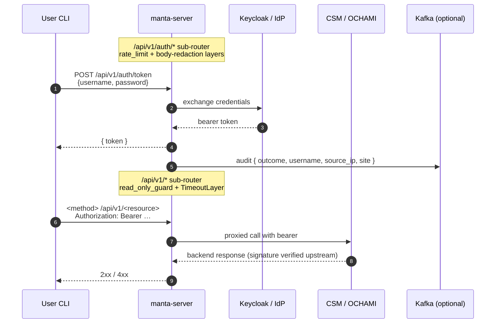

# Security Policy

This document is for **security researchers, operators, and integrators**
who need to understand manta's security model end-to-end or who have
found a potential vulnerability.

For deeper technical detail on each control, see
[ARCHITECTURE.md §Security model](ARCHITECTURE.md#security-model). For
the operator-facing rollout of the JWT-role read-only gate, see
[MIGRATING.md §2.7](MIGRATING.md#27-read-only-access-optional). For the
user-facing description of both read-only policies (CLI flag + JWT
role), see [GUIDE.md §13](GUIDE.md#13-read-only-access).

## Reporting a vulnerability

**Do not open a public GitHub issue for a suspected vulnerability.**
We use private disclosure channels:

1. **Preferred — GitHub Security Advisories.** Open a private advisory
   at
   <https://github.com/eth-cscs/manta/security/advisories/new>.
   This keeps the report invisible to the public while the fix is
   prepared.
2. **Fallback — email.** If you cannot use GitHub Security Advisories,
   email the maintainers directly:
   - Manuel Sopena Ballesteros — `msopena@cscs.ch`
   - Miguel Gila — `miguel.gila@cscs.ch`
   Use a subject prefix like `[manta-security]` so the report routes
   correctly. PGP is not currently configured for these addresses —
   if you need encrypted transport, reach out first to coordinate.

Please include, at minimum:

- The version (`manta --version` and `manta-server --version`) where you
  observed the issue.
- A reproduction (HTTP request, CLI invocation, or test script).
- The impact you assess (what an attacker can do).
- Your disclosure timeline preference, if any.

We will acknowledge receipt within **5 working days** and provide a
status update within **15 working days**. If the report is in scope, a
fix and coordinated disclosure timeline will be agreed before any
public discussion of the issue.

## Supported versions

manta 2.x is the actively-maintained line; the 1.x series did not
have a server binary and is no longer maintained.

| Version | Status | Security fixes |
|---|---|---|
| `2.0.0-beta.x` (current) | active development | yes — on `main` |
| `2.0.0` (when released) | active | yes — backported to the release branch |
| `1.x` | unmaintained | **no** |

During the `2.0.0-beta.x` series, fixes land on `main` and ride out on
the next beta tag. There is no separate security branch — operators
running a pinned beta should plan to upgrade promptly when an advisory
lands.

## Security model — at a glance

manta is a 3-tier system. The sequence below shows the bootstrap
auth call and a subsequent authenticated request:

*Sequence: bootstrap (auth) then a subsequent authenticated request.*

For the user-facing read-only flow specifically, see
[GUIDE.md §13 — Read-only access](GUIDE.md#13-read-only-access).
For where the middleware layers sit in the request pipeline, see
[ARCHITECTURE.md → Middleware layer stack](ARCHITECTURE.md#middleware-layer-stack).

- **CLI side** (`manta` binary): a thin client that runs on operator
  workstations. Holds the user's bearer token in a 0600 cache file
  under the platform config dir. Never speaks to CSM/OCHAMI directly.
- **Server side** (`manta-server` binary): the
  credential-handling chokepoint. Receives user/password on
  `POST /api/v1/auth/token`, exchanges them with the per-site backend,
  returns the bearer token to the CLI. Subsequent authenticated
  endpoints proxy backend calls using the user's token.
- **Upstream** (CSM / OpenCHAMI / Keycloak): not part of this repo.
  Signature verification of the bearer token happens here, at the
  first backend round-trip.

Because `manta-server` sees every authentication attempt and holds
per-site service-account tokens (for k8s, Vault, Gitea), **it is a
single point of compromise** for every site it serves. Operate it
accordingly.

## Controls — what is enforced where

### In code (the manta binaries)

| Control | Where | Notes |
|---|---|---|
| TLS required by default | `manta-server` | Server fails closed without `cert` + `key`. Pass `--allow-http` only when TLS terminates upstream. |
| HSTS on every response | `manta-server` | `Strict-Transport-Security: max-age=31536000; includeSubDomains`. No-op over plain HTTP per RFC 6797. |
| Per-source-IP rate limit on `/api/v1/auth/*` | `manta-server` | `[server].auth_rate_limit_per_minute` (default 60). Implementation in `server::auth_middleware::rate_limit`. |
| Generic 401 on every auth failure | `manta-server` | `server::handlers::auth_token` returns identical `"invalid credentials"` body regardless of whether the user was unknown or the password was wrong. Detail stays in server-side `tracing::warn!`. |
| Audit event per auth attempt | `manta-server` | When `[auditor.kafka]` is configured, `server::common::audit::send_auth_audit` emits `{ outcome, username, source_ip, site }`. Credentials are never logged. |
| Body redaction on `/auth/*` log spans | `manta-server` | `server::auth_middleware::strip_body_for_logs`. |
| **JWT-role read-only gate on `/api/v1/*`** | `manta-server` | `server::auth_middleware::read_only_guard` refuses `POST`/`PUT`/`PATCH`/`DELETE` with `403` when the token's `realm_access.roles` claim contains `manta-read-only`. Defence in depth, **not** a signature-verification boundary — see Known limitations below. |
| CLI-side read-only toggle | `manta-cli` | `read_only = true` in `cli.toml` (or `manta config set read-only`) refuses mutating verbs before any HTTP request leaves the process. Independent of the JWT-role gate. |
| 0600 mode on cached tokens | `manta-cli` | Token cache file written with `0600` perms under the platform config dir; never logged. |

### In ops (your deployment)

| Control | Notes |
|---|---|
| TLS termination, WAF, reverse-proxy rate limit | First line of defence; manta-server's in-process limiter is belt-and-braces. |
| Service-account scoping at CSM / Vault | Limit what the manta-server-issued tokens can do at the backend. |
| Network segmentation | Treat manta-server as a privileged host. |
| Realm-role provisioning in Keycloak | Provision `manta-read-only` (and any other least-privilege roles) per-user; see [MIGRATING.md §2.7](MIGRATING.md#27-read-only-access-optional). |
| `[server].migrate_backup_root` set explicitly | Confines `POST /migrate/{backup,restore}` paths. Server returns `400` for those endpoints when unset, even for admin callers. |

## Known limitations

**No local signature verification.** `server::common::jwt_ops` decodes
the JWT body without verifying its signature. This is documented
inline at the top of that module. Consequences:

- The `is_user_admin` and `manta-read-only` role gates are **advisory**
  in the sense that a forged token passing the decode step is detected
  only at the first backend round-trip, where CSM/OCHAMI rejects it.
- The role gates are still useful as **defence in depth**: they
  reduce the blast radius of a token whose signature does verify but
  whose user's permissions should be tighter than what the backend
  would otherwise allow.
- Local JWKS-based signature verification (per-site cache, `kid`-based
  rotation) is the long-term direction. The role gates inherit that
  verification automatically when it lands; no per-gate work needed.

**Single point of compromise.** As noted above, owning `manta-server`
gives an attacker visibility into every auth attempt and access to
configured service-account tokens. Mitigations are split between
code (rate limit, generic 401, body redaction) and ops (TLS
termination upstream, service-account scoping, network segmentation).

**Deferred: forwarding the original client IP to Keycloak via
`X-Forwarded-For`** on the upstream auth call. Tracked as a follow-up
because the current `AuthenticationTrait::get_api_token` signature in
`manta-backend-dispatcher` does not take a header argument; landing
this requires a sibling-repo upgrade.

## Cryptography notes

- **TLS:** ring (the `rustls` `CryptoProvider`); 1.2/1.3 per `rustls`
  defaults. Configure cipher suites and protocol versions at your
  reverse proxy if you need to constrain them further.
- **JWT decode:** `base64::prelude::BASE64_URL_SAFE_NO_PAD` with a
  fall-back to `BASE64_STANDARD`. No signature verification (see Known
  limitations).
- **Password handling:** credentials submitted to `/api/v1/auth/token`
  are deserialised into `serde` types, forwarded to the configured
  backend, and dropped. They are not written to disk; they are not
  emitted to any log span (see `strip_body_for_logs`).

## Out of scope for this document

- Code-quality issues that are not security-relevant — open a regular
  GitHub issue.
- Vulnerabilities in upstream sibling crates (`csm-rs`, `ochami-rs`,
  `manta-backend-dispatcher`) — report directly against those repos.
  If you're unsure where a finding belongs, send it here and we will
  triage.
- Vulnerabilities in the user's identity provider (Keycloak, etc.) or
  in the backends (CSM, OpenCHAMI) — out of manta's scope; report
  upstream.
